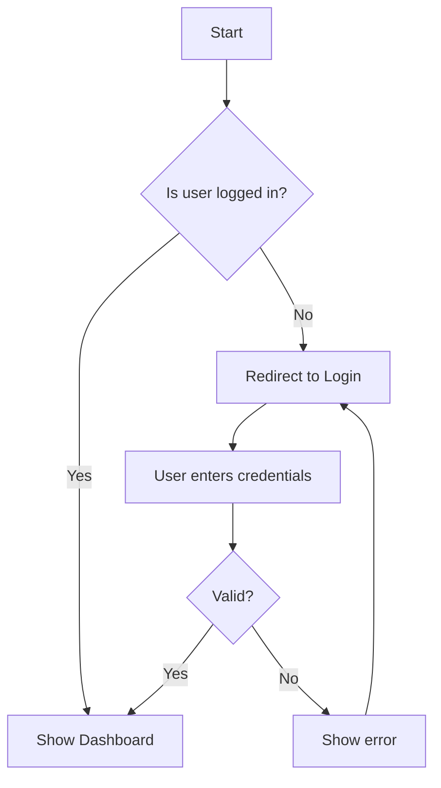
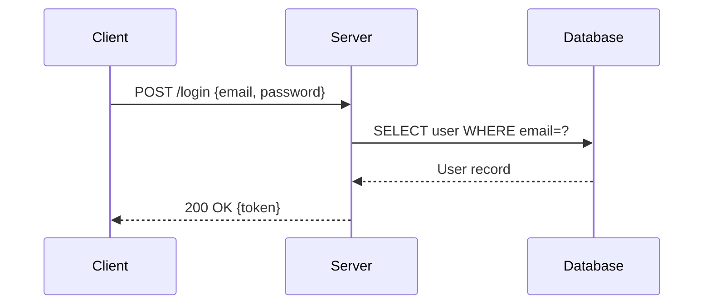
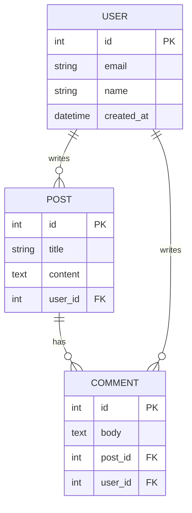
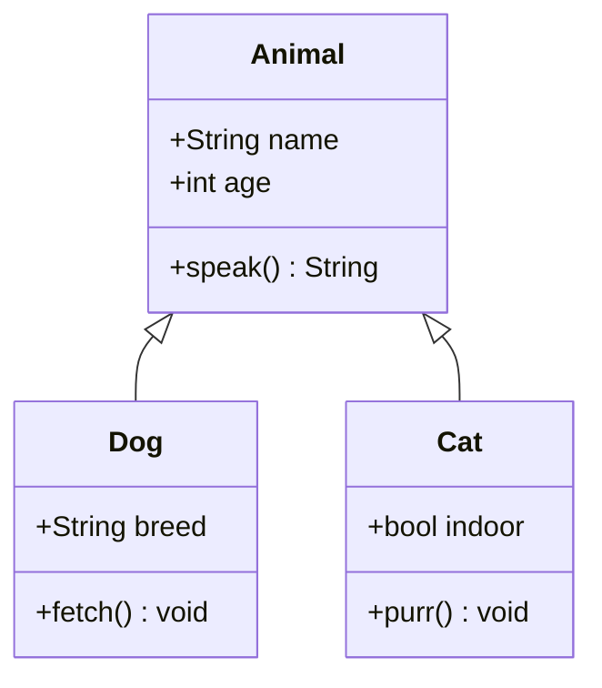
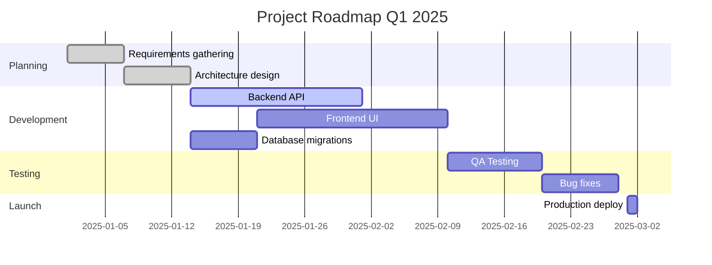
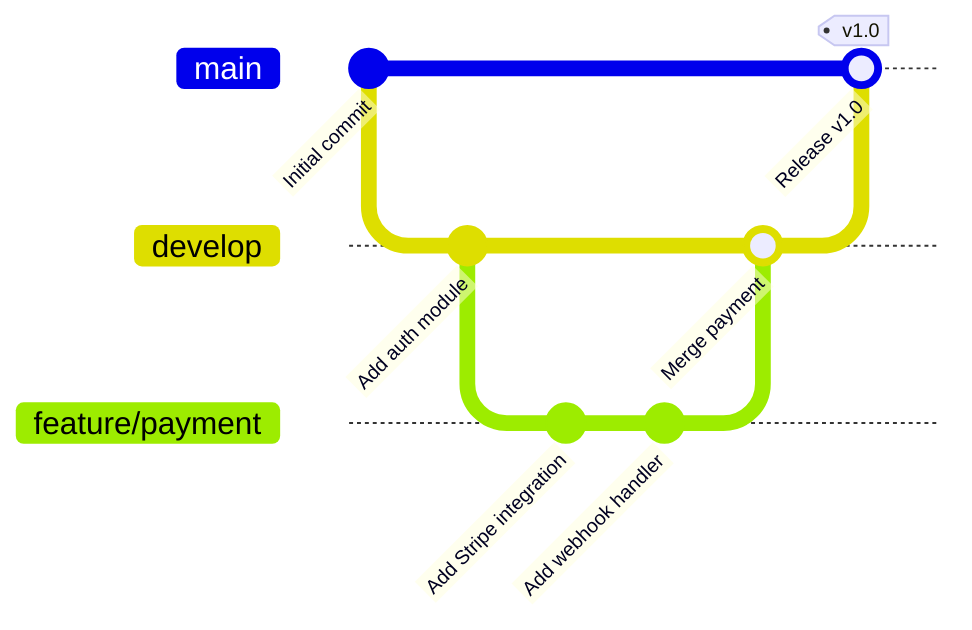
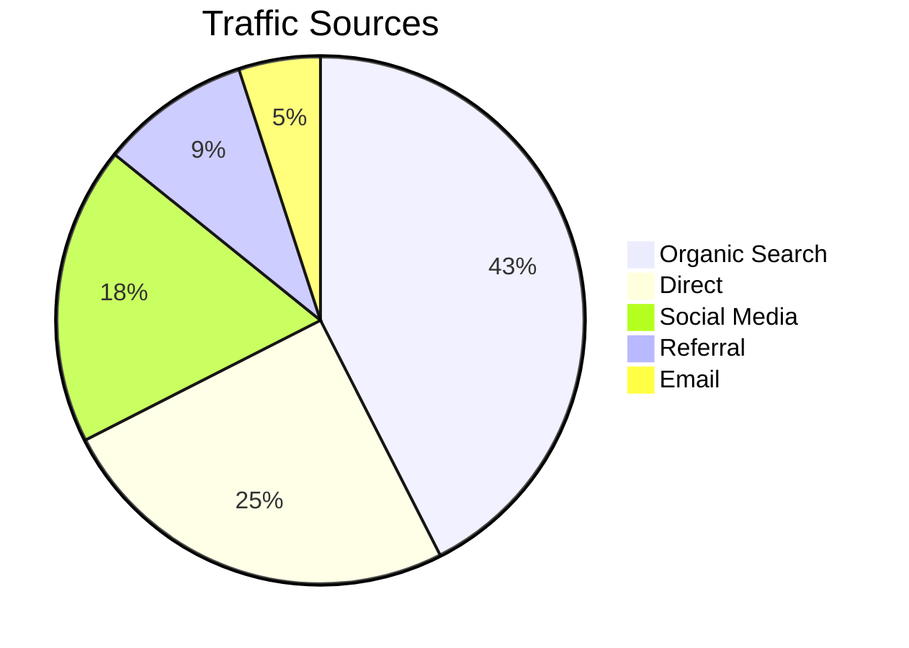
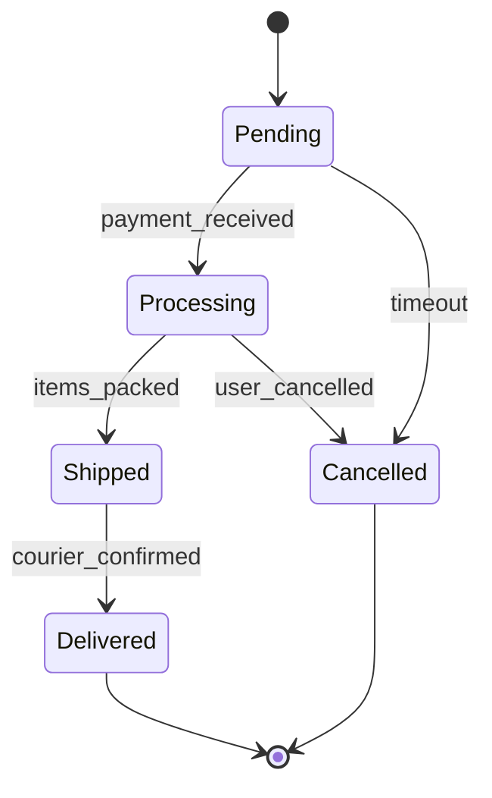

# 🧜 Mermaid Diagrams — Complete Tutorial

Mermaid is a **JavaScript-based diagramming tool** that lets you write diagrams as text — no drag-and-drop, no mouse required. It renders directly in GitHub, GitLab, Notion, and VS Code.

---

## Why Use Mermaid?

| Benefit | Description |
|---|---|
| **Text-based** | Diagrams live in your repo alongside code |
| **Version control** | Diff diagrams like code |
| **Native GitHub support** | No plugins needed |
| **AI-friendly** | LLMs can generate Mermaid easily |
| **Fast** | Write a diagram in 2 minutes |

---

## Diagram Types

### 1. Flowchart

The most versatile diagram. Use for: processes, decision trees, user flows.



**Syntax cheat sheet:**
- `TD` = Top Down, `LR` = Left Right, `BT` = Bottom Top, `RL` = Right Left
- `[text]` = rectangle, `{text}` = diamond (decision), `(text)` = rounded, `((text))` = circle
- `-->` = arrow, `---` = line, `-.->` = dashed arrow, `==>` = thick arrow
- `-- label -->` = labeled arrow

---

### 2. Sequence Diagram

Use for: API calls, authentication flows, service communication.



**Syntax cheat sheet:**
- `participant A as Alias` = define actor
- `->>` = solid arrow, `-->>` = dashed arrow (response)
- `activate A` / `deactivate A` = show activation box
- `Note over A,B: text` = add note
- `loop ... end` = loop block
- `alt ... else ... end` = conditional block

---

### 3. Entity Relationship Diagram (ERD)

Use for: database schema, data modeling.



**Relationship syntax:**
- `||--||` = one-to-one
- `||--o{` = one-to-many
- `}o--o{` = many-to-many
- `|o--o|` = zero-or-one to zero-or-one

---

### 4. Class Diagram

Use for: OOP design, system structure, API contracts.



**Relationship types:**
- `<|--` = inheritance
- `*--` = composition
- `o--` = aggregation
- `-->` = association
- `..>` = dependency

---

### 5. Gantt Chart

Use for: project timelines, sprint planning, roadmaps.



---

### 6. Git Graph

Use for: branching strategy, git workflow visualization.



---

### 7. Pie Chart

Use for: distribution data, quick stats.



---

### 8. State Diagram

Use for: state machines, order status, user sessions.



---

## Where to Use Mermaid

### GitHub / GitLab
Just wrap in triple backticks with `mermaid`:
````

````
✅ Renders automatically in `.md` files, PRs, Issues, Wikis.

### Notion
1. Type `/code` to insert a code block
2. Change language to `mermaid`
3. Paste your diagram code
✅ Renders live in Notion

### VS Code
Install the **Mermaid Preview** extension:
- Search: `bierner.markdown-mermaid`
- Open a `.md` file → preview renders Mermaid

### Online Editor
- **Mermaid Live Editor**: https://mermaid.live
- Paste code → see live preview → export as PNG/SVG

---

## AI Prompt Templates for Mermaid

### Generate from description:
```
Generate a Mermaid flowchart for the following process:
[describe your process]

Requirements:
- Use flowchart TD (top-down)
- Include decision nodes for [key decisions]
- Show error/failure paths
- Keep it under 15 nodes for readability
```

### Sequence diagram prompt:
```
Create a Mermaid sequenceDiagram for:
[describe the interaction]

Participants involved: [list services/actors]
Show: request, response, error cases
Use -->> for responses (dashed)
```

### Architecture diagram prompt:
```
Draw a system architecture diagram using Mermaid flowchart LR for:
[system name and description]

Components to include:
- [Frontend/clients]
- [Backend services]
- [Databases]
- [External services]

Show data flow with labeled arrows.
Group related components using subgraph.
```

### ERD prompt:
```
Generate a Mermaid erDiagram for a [domain] application with these entities:
[list your entities and key fields]

Include: primary keys (PK), foreign keys (FK)
Show all relationships with correct cardinality (one-to-many, etc.)
```

---

## Common Pitfalls & Fixes

### ❌ Special characters break parsing
```
# WRONG
flowchart TD
    A[User's input] --> B[Process & validate]
```
```
# CORRECT — use quotes or escape
flowchart TD
    A["User's input"] --> B["Process & validate"]
```

### ❌ Node IDs with spaces
```
# WRONG
flowchart TD
    User Login --> Dashboard
```
```
# CORRECT
flowchart TD
    UserLogin[User Login] --> Dashboard
```

### ❌ Very long labels make diagrams unreadable
Keep node labels short (< 30 chars). Use a legend or notes section in the document for details.

### ❌ Forgetting `participant` in sequence diagrams
Always declare participants at the top so the order is predictable.

### ✅ Tips
- Use `%%` for comments: `%% This is a comment`
- Use `subgraph` to group related nodes
- Prefer `LR` for wide systems, `TD` for processes
- Test in https://mermaid.live before committing

---

## Quick Reference Card

```
Flowchart:      flowchart TD/LR
Sequence:       sequenceDiagram
ER Diagram:     erDiagram
Class:          classDiagram
Gantt:          gantt
Git:            gitGraph
Pie:            pie
State:          stateDiagram-v2
```

---

## Examples in This Folder

| File | What's Inside |
|---|---|
| [examples/flowchart.md](examples/flowchart.md) | Auth flow, CI/CD pipeline, e-commerce checkout, incident response, data processing |
| [examples/sequence.md](examples/sequence.md) | API calls, auth, service-to-service communication |
| [examples/architecture.md](examples/architecture.md) | URL shortener, real-time chat, e-commerce platform |
| [examples/ai-architecture.md](examples/ai-architecture.md) | RAG pipeline, LLM API gateway, MLOps, AI agent |
| [examples/cloud-infra.md](examples/cloud-infra.md) | AWS three-tier app, Kubernetes cluster, multi-cloud, CI/CD to k8s |
| [examples/work-progress.md](examples/work-progress.md) | Sprint board, project Gantt, incident response, feature delivery workflow |

➡️ Looking for a blank starting point? See [templates/](../templates/) for ready-to-use templates.
