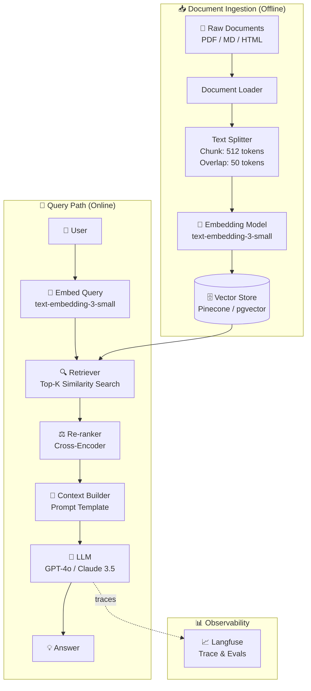
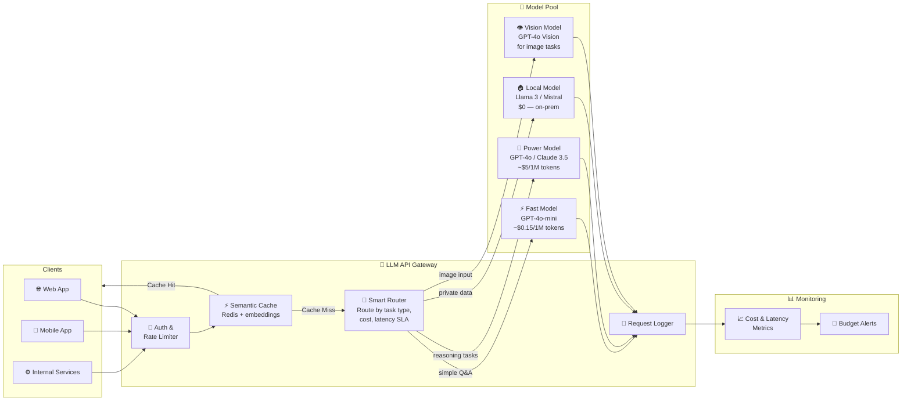
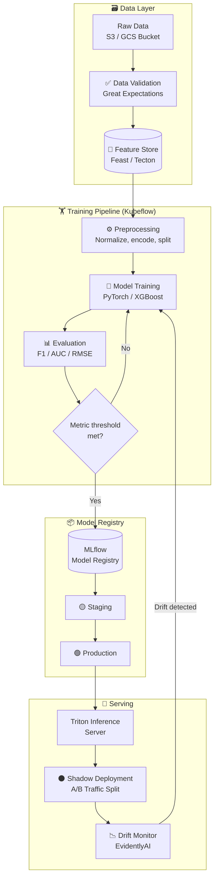
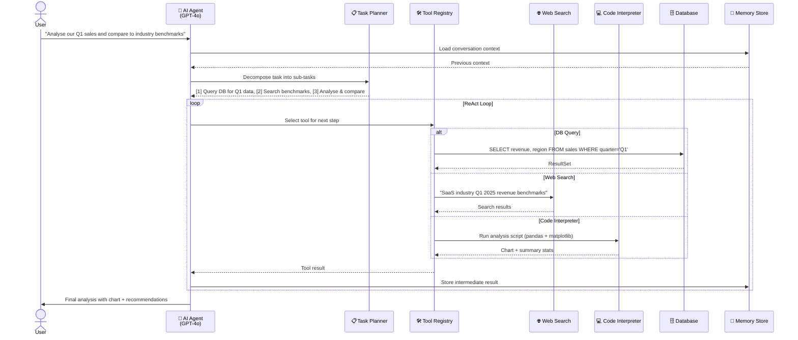

# 🤖 AI / ML Architecture Examples

Four production-style AI/ML system diagrams with complete Mermaid code.

---

## 1. RAG Pipeline (Retrieval-Augmented Generation)

The backbone of most production AI chatbots and knowledge-base assistants.

**Key design decisions:**
- **Chunking overlap** prevents context from being split at sentence boundaries
- **Re-ranker** reduces hallucination by filtering noisy top-K results to top-3
- **Separate embedding pipelines** for ingestion vs. query allows model upgrades without re-querying

---

## 2. LLM API Gateway (Multi-Model Routing)

Route requests to the cheapest/fastest model that can handle the task.

**Cost optimization levers:**
- Semantic cache: identical or near-identical questions skip the model entirely
- Smart routing: 60-70% of requests go to the cheap fast model
- Local model: GDPR-sensitive data never leaves your infra

---

## 3. MLOps Training Pipeline

From raw data to a deployed, monitored model.

---

## 4. AI Agent with Tool Use (ReAct Pattern)

A single-agent loop that plans, calls tools, and synthesises results.

