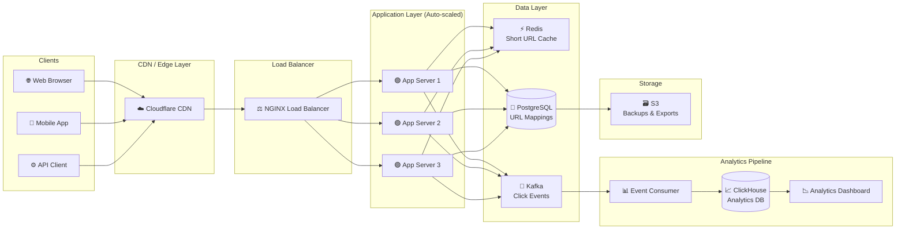
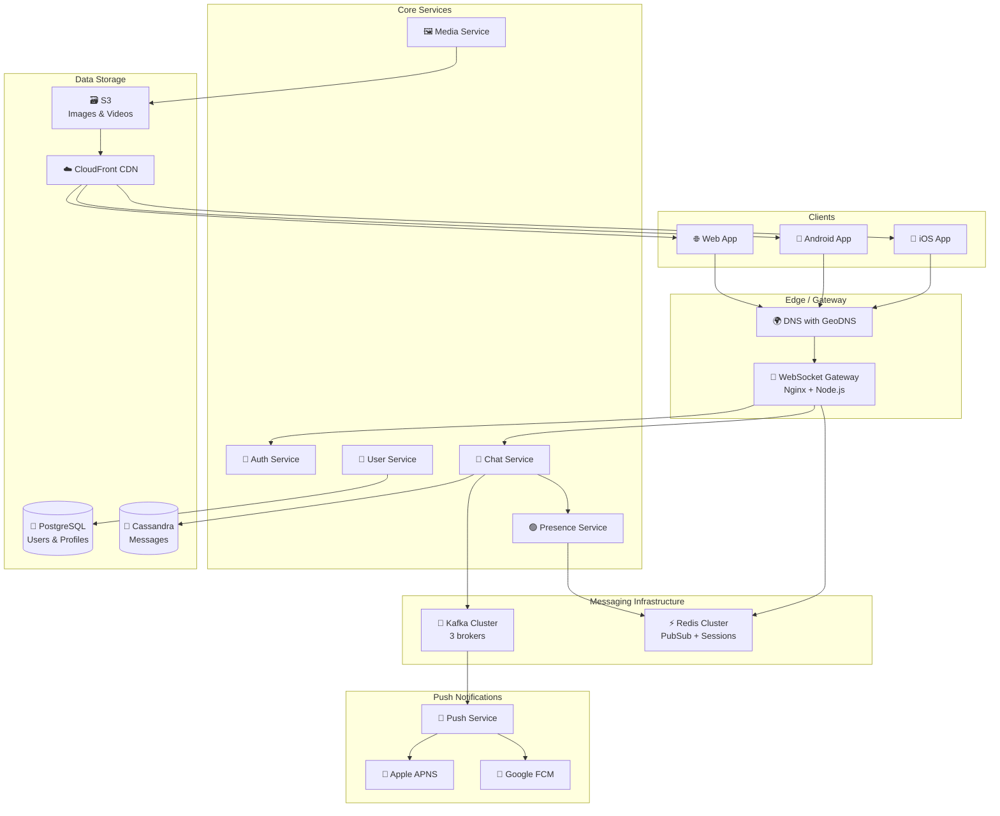
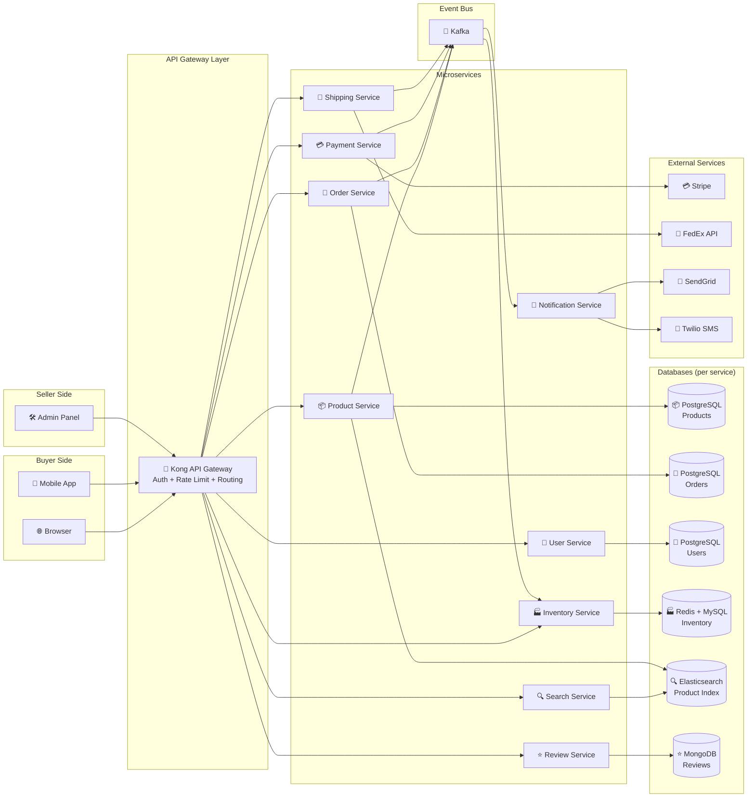

# 🏗️ System Architecture Examples

Three production-ready system architecture diagrams using Mermaid flowcharts.

---

## 1. URL Shortener (like bit.ly)

A scalable URL shortener with analytics.

**Key flows:**
- **Shorten URL:** `POST /shorten` → App → Generate 6-char code → Store in PostgreSQL → Cache in Redis → Return short URL
- **Redirect:** `GET /:code` → App → Check Redis → (if miss) check PostgreSQL → 301 redirect → Emit click event to Kafka
- **Analytics:** Kafka consumer aggregates click events into ClickHouse for real-time dashboards

---

## 2. Real-time Chat Application (like WhatsApp)

A distributed chat system supporting millions of concurrent connections.

**Key design decisions:**
- **WebSocket Gateway** holds persistent connections; stateless app servers communicate via Redis PubSub
- **Cassandra** for messages: optimized for write-heavy workloads, time-series partitioning by chat room
- **GeoDNS** routes users to nearest data center (US, EU, Asia)
- **Kafka** decouples chat events from push notifications

---

## 3. E-Commerce Platform (like Shopify)

A microservices-based e-commerce platform.

**Key design decisions:**
- **Kong API Gateway** handles auth, rate limiting, and routing for all services
- **Database-per-service** pattern: each microservice owns its data store
- **Kafka** as event bus: order.created → trigger inventory deduction, payment, shipping, notifications
- **Elasticsearch** for product search with faceted filtering
- **MongoDB** for reviews: flexible schema for different product types

---

## Diagram Tips for Architecture

1. **Use `subgraph`** to group logical layers (clients, services, databases)
2. **Add emojis** to labels — makes components visually scannable
3. **Use `LR`** (left-right) for pipeline/layered architectures
4. **Use `TD`** (top-down) for hierarchical systems
5. **Label arrows** to show protocol or data type: `-->|gRPC|`, `-->|REST|`, `-->|events|`
6. **Keep it at the right abstraction level** — don't show every micro-detail

---

> ➡️ See [05-real-world/README.md](../../05-real-world/README.md) for detailed case studies with design decisions.
