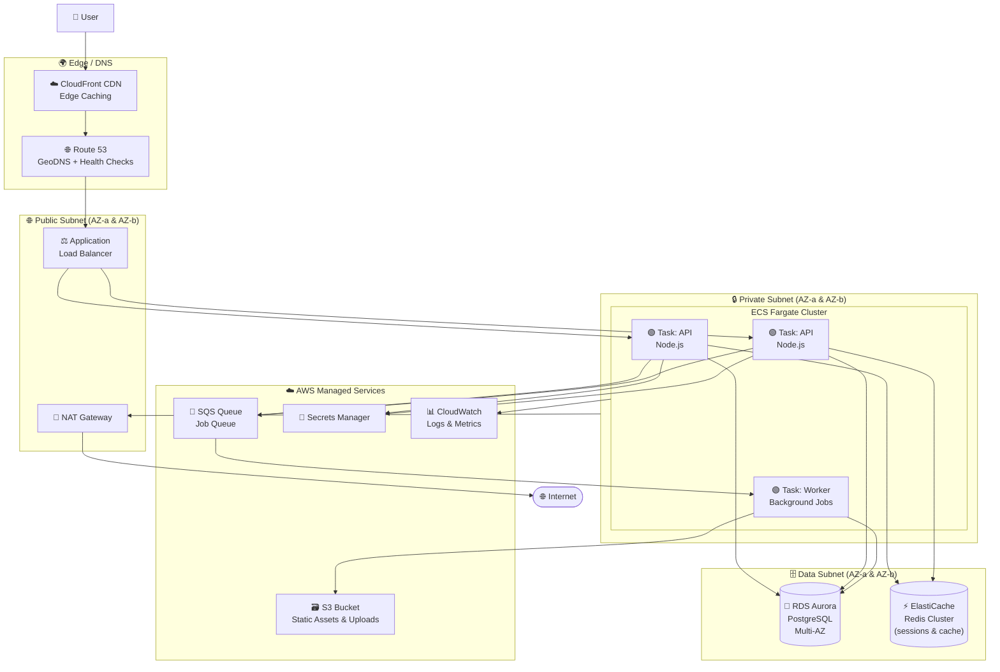
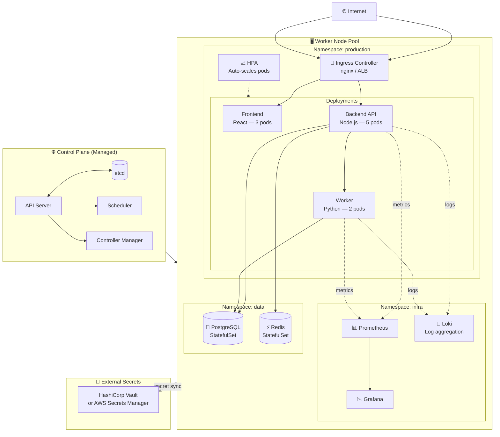
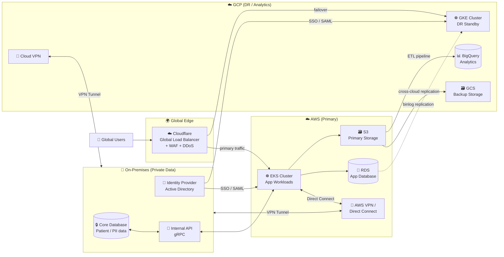
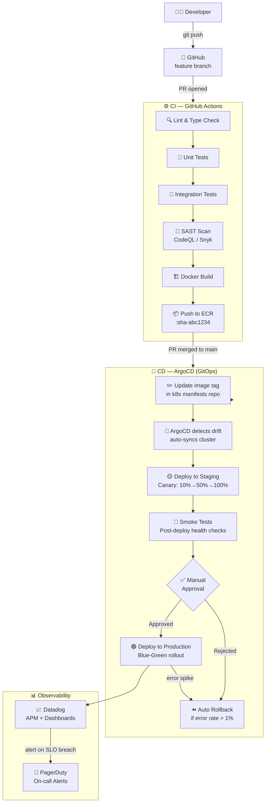

# ☁️ Cloud Infrastructure Examples

Four production cloud architecture diagrams with complete Mermaid code.

---

## 1. AWS Three-Tier Web Application

Classic scalable web app: CDN → ALB → ECS → RDS.

**Key AWS services explained:**
- **CloudFront** caches static assets at edge; reduces ALB load by ~40%
- **ECS Fargate** — no EC2 to manage; scales containers automatically
- **Aurora Multi-AZ** — synchronous standby replica; sub-30s failover
- **ElastiCache** stores sessions so any task can serve any user

---

## 2. Kubernetes Cluster Architecture

Production k8s cluster on EKS/GKE with namespaced workloads.

---

## 3. Multi-Cloud / Hybrid Architecture

Primary on AWS, disaster recovery on GCP, on-prem for sensitive data.

---

## 4. CI/CD to Cloud Deployment Pipeline

From `git push` to production on Kubernetes.

