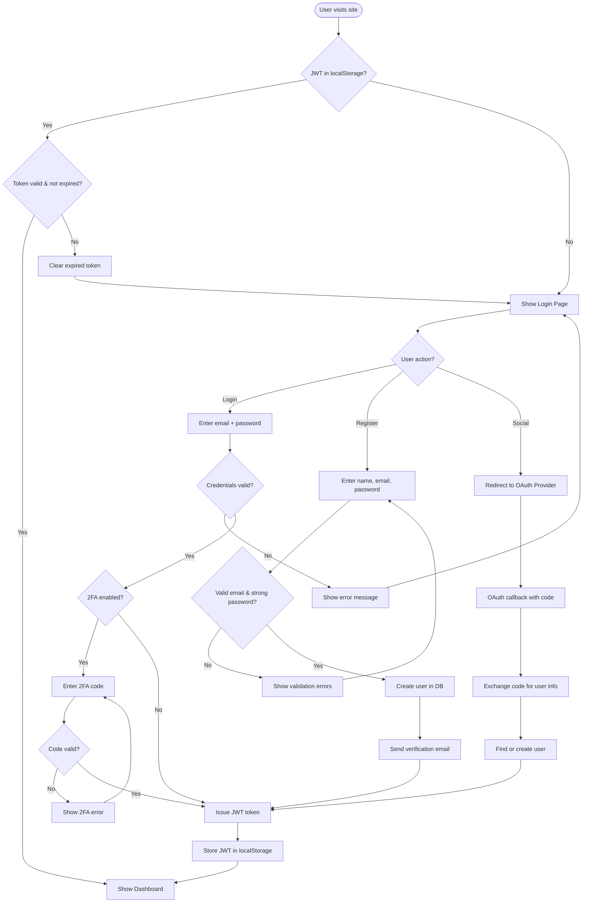
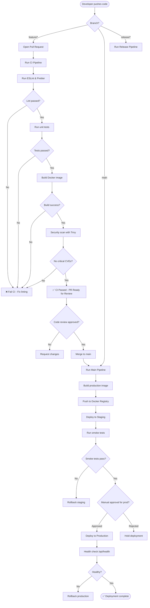
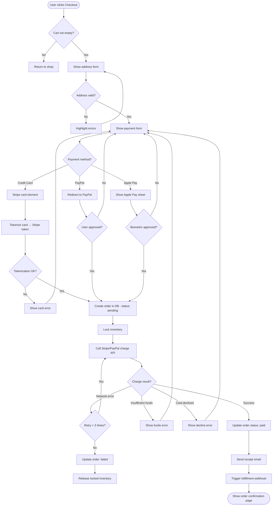
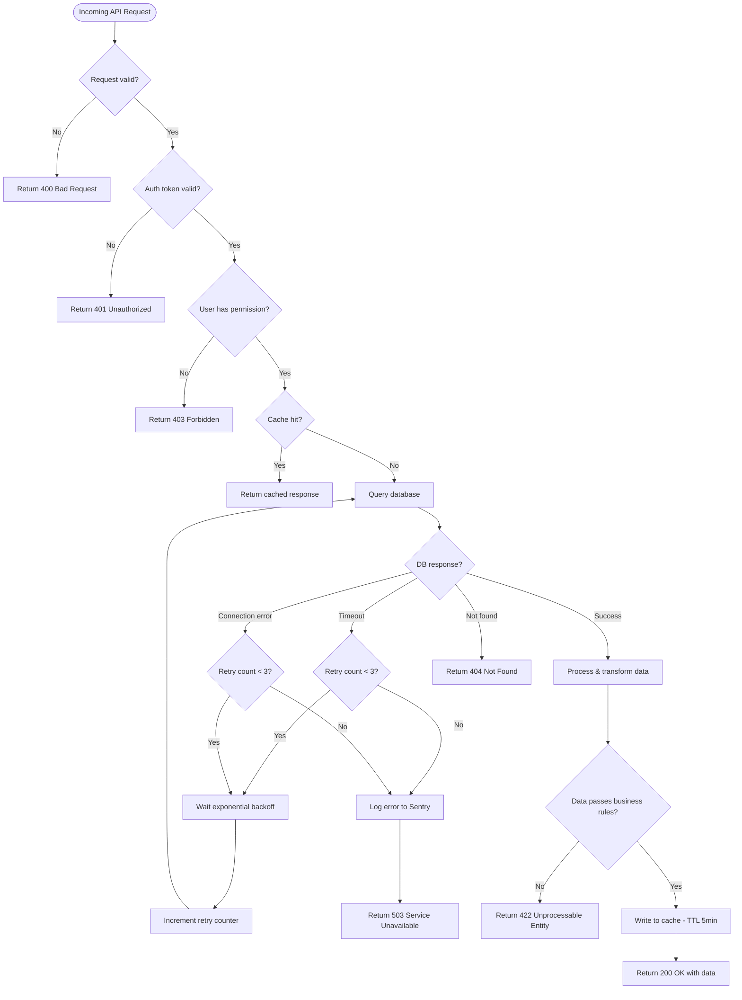
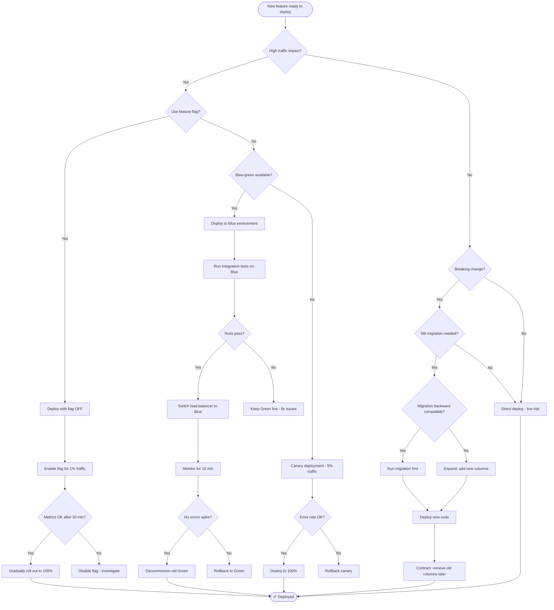

# 🔀 Flowchart Examples

Five real-world flowchart examples with complete Mermaid code.

---

## 1. User Authentication Flow

A complete login/registration flow with JWT tokens.

---

## 2. CI/CD Pipeline Flow

A typical GitHub Actions CI/CD pipeline for a Node.js app.

---

## 3. Payment Processing Flow

An e-commerce payment flow with Stripe integration.

---

## 4. Error Handling & Retry Logic

A resilient API call with exponential backoff.

---

## 5. Deployment Decision Tree

Deciding how to deploy a new feature safely.

---

> 💡 **Tip:** Copy any of these code blocks into https://mermaid.live to preview and customize them.
