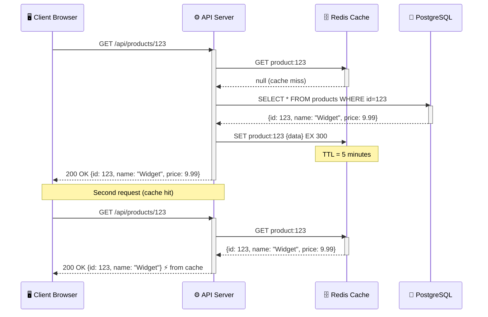
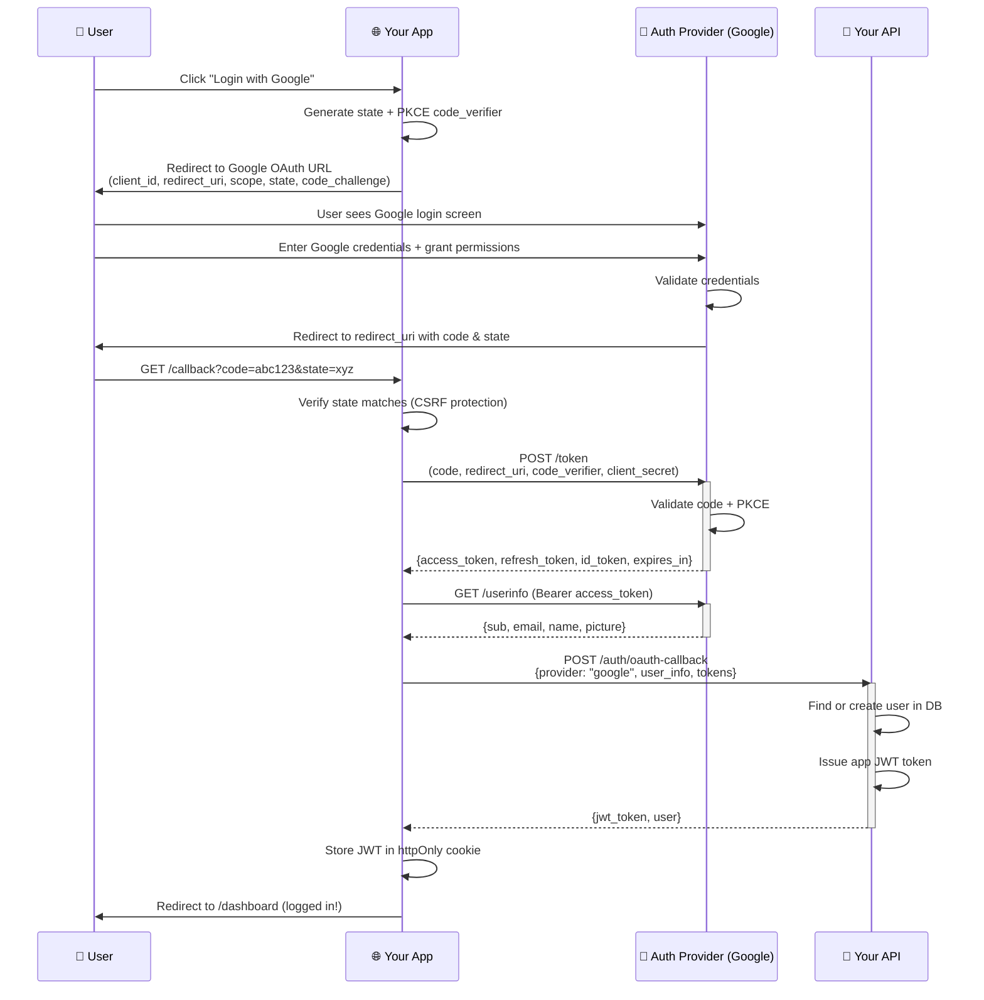
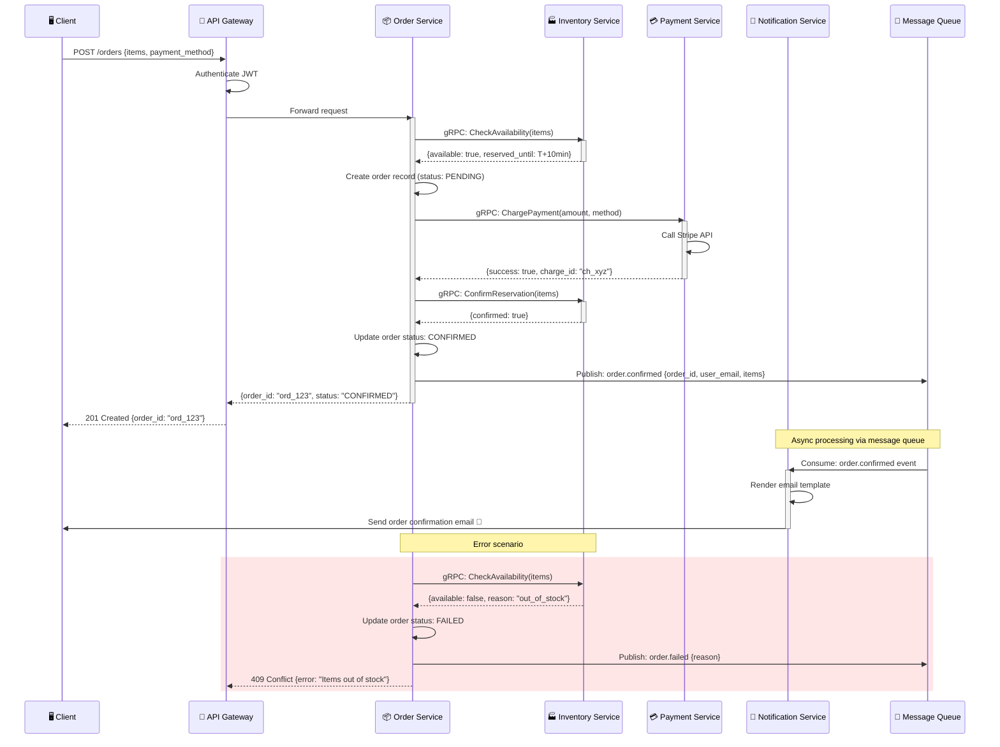
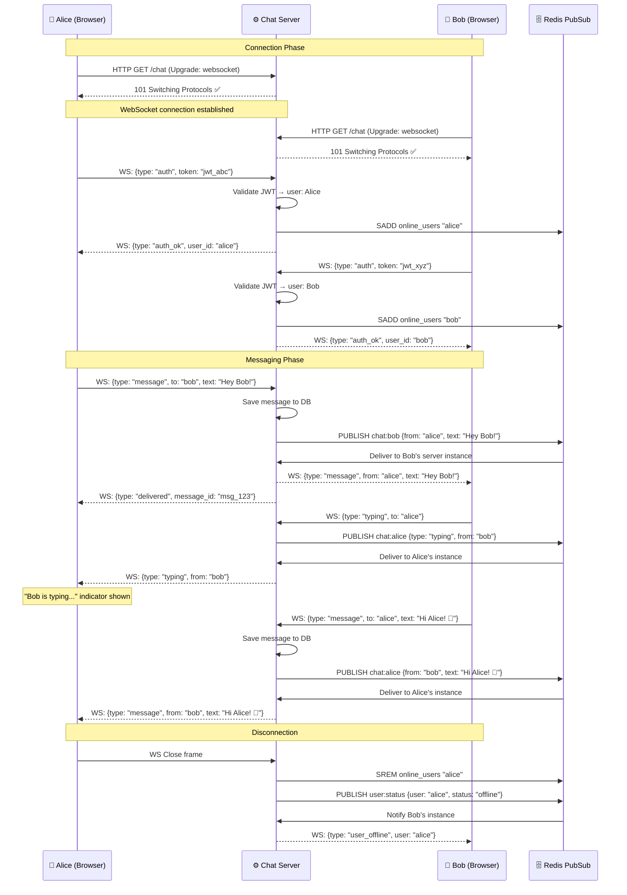

# 🔁 Sequence Diagram Examples

Four real-world sequence diagrams showing service communication patterns.

---

## 1. REST API Request with Caching

A standard REST API call with Redis caching layer.

---

## 2. OAuth 2.0 Authorization Code Flow

The complete OAuth flow used by "Login with Google/GitHub".

---

## 3. Microservices Order Flow

How multiple microservices coordinate to process an order.

---

## 4. WebSocket Real-time Chat

How WebSocket connections work in a chat application.

---

> 💡 **Tip:** Sequence diagrams are perfect for documenting APIs. Include them in your API docs to show the exact message flow.
