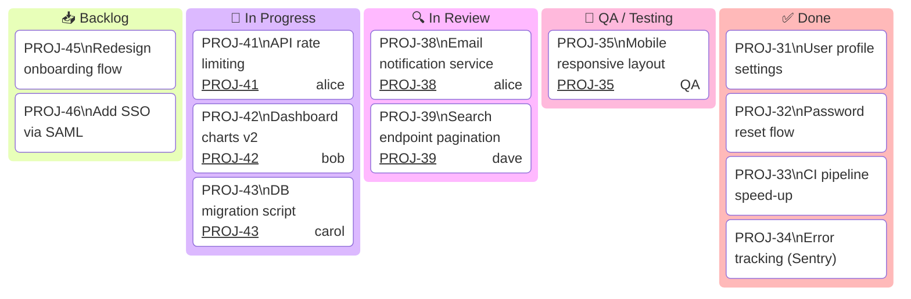
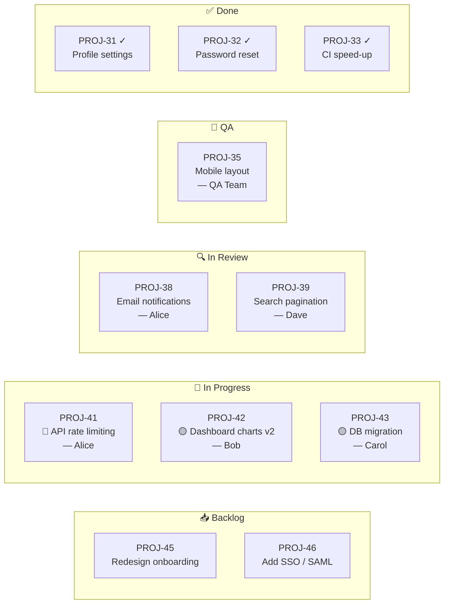
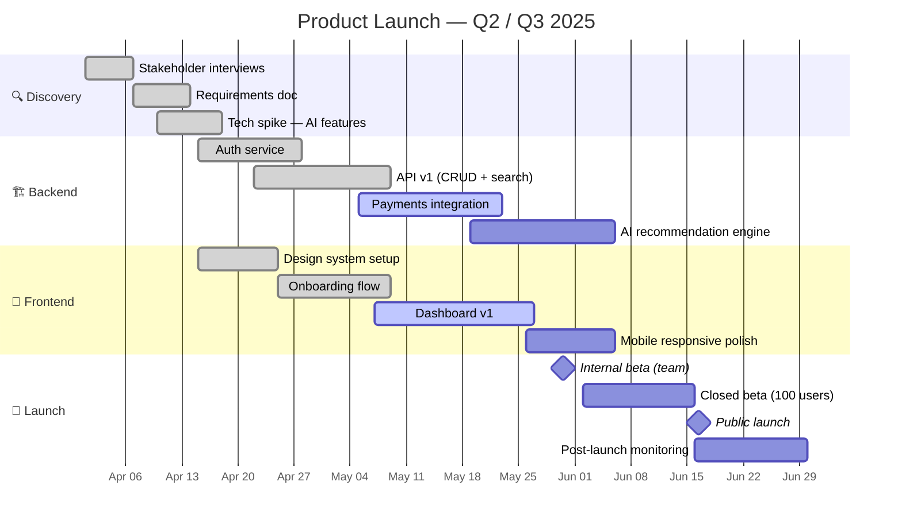
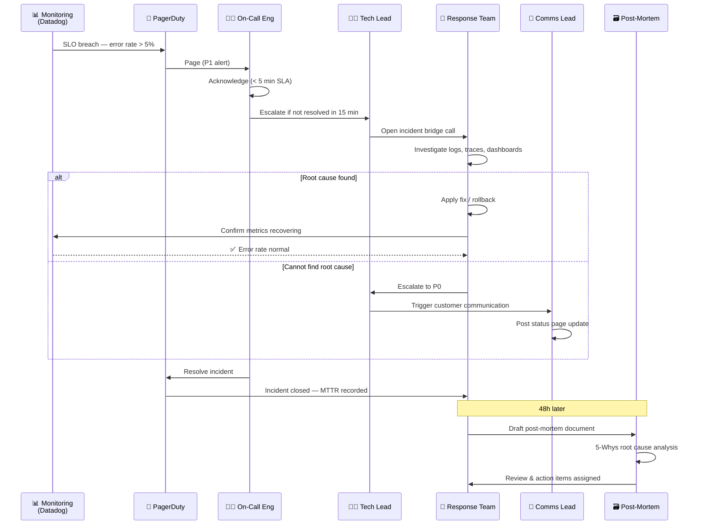
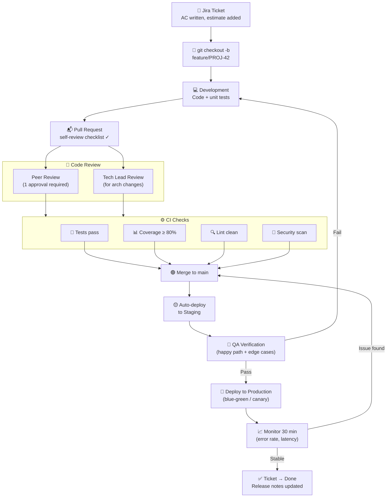

# 📅 Work Progress Examples

Four diagrams for tracking project status, sprint work, team workflows, and release timelines.

---

## 1. Sprint Board (Kanban-style)

Visual snapshot of a two-week sprint — great for standups and stakeholder updates.

> **Tip:** If your Mermaid renderer doesn't support `kanban` yet, use the flowchart version below.

### Flowchart alternative (universal support)

---

## 2. Project Timeline (Gantt Chart)

Quarter-view roadmap for a product launch — useful for execs and PMs.

---

## 3. Team Incident Response Workflow

Who does what when production goes down — from alert to post-mortem.

---

## 4. Feature Delivery Workflow (PR to Production)

From ticket creation to deployed feature — end to end.

