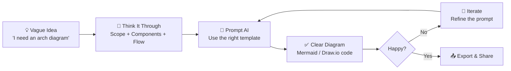
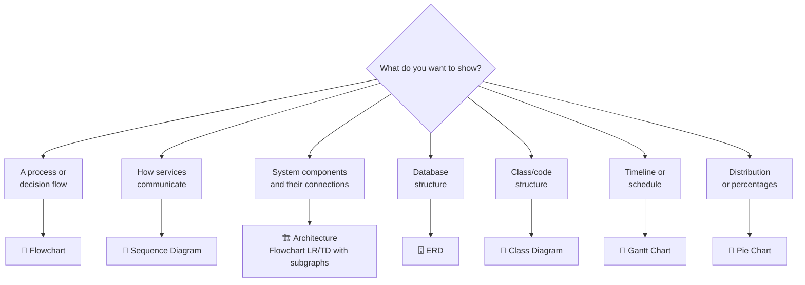
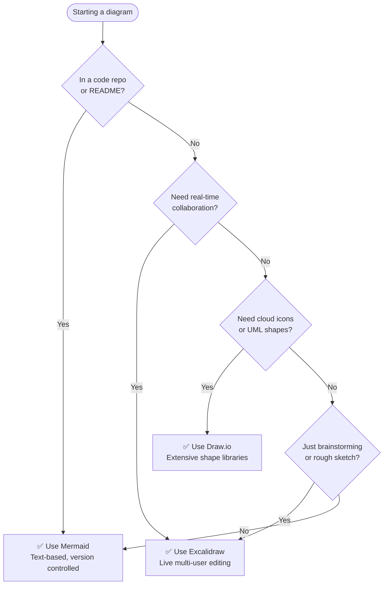

# 🤖 AI Prompt Guide for Architecture Diagrams

The ultimate collection of prompts, frameworks, and strategies to go from **vague idea → clear diagram** using AI.

---

## The Core Framework: 3 Steps to a Great Diagram



---

## Step 1: Think Before You Prompt

Before opening ChatGPT, answer these 3 questions:

**1. What system am I diagramming?**
> "A URL shortener service" / "Our checkout microservice" / "The user auth flow"

**2. Who is the audience?**
> - Engineers → show technical detail (databases, APIs, protocols)
> - Managers → show components and flow (no implementation details)
> - New hire → show the big picture first

**3. What type of diagram do I need?**



---

## Which Tool Should I Use?



---

## 20+ Copy-Paste Prompt Templates

### 🔀 FLOWCHARTS

**Template 1: Process Flow**
```
Generate a Mermaid flowchart TD for the following process:

Process: [describe the process in 2-3 sentences]

Requirements:
- Show the happy path clearly
- Include decision points for: [list key decisions]
- Show error/failure paths
- End with clear success and failure states
- Use descriptive labels on decision nodes (questions)
- Keep under 15 nodes total for readability

Output only the Mermaid code block.
```

**Template 2: User Journey**
```
Create a Mermaid flowchart showing the user journey for:
[feature or action, e.g., "checking out and purchasing items"]

Actors involved: [e.g., "guest user, logged-in user, admin"]

Include:
- Entry points (how users start this journey)
- Key decision points (logged in? valid payment?)
- Success path
- Error handling paths
- Exit points

Use subgraph to group related steps if needed.
Output only valid Mermaid code.
```

**Template 3: Decision Tree**
```
Create a Mermaid flowchart for a decision tree that helps decide:
[what decision, e.g., "which deployment strategy to use"]

Decision factors:
- [Factor 1, e.g., "Is this a high-traffic feature?"]
- [Factor 2, e.g., "Do we have blue-green infrastructure?"]
- [Factor 3]

Possible outcomes:
- [Outcome 1, e.g., "Feature flags"]
- [Outcome 2, e.g., "Blue-green deployment"]
- [Outcome 3, e.g., "Direct deploy"]

Use flowchart TD. Output only the Mermaid code.
```

---

### 🔁 SEQUENCE DIAGRAMS

**Template 4: API Integration**
```
Write a Mermaid sequenceDiagram for the following API interaction:

System: [what system/feature]
Participants: [list all services/actors, e.g., "Browser, API Server, Database, Cache"]

Show these interactions:
1. [Step 1, e.g., "Client sends GET /resource/123"]
2. [Step 2, e.g., "Server checks cache"]
3. [Step 3, e.g., "Cache miss → query database"]
4. [Step 4, e.g., "Return data to client"]

Also show the error case where [describe error scenario].

Use ->> for requests and -->> for responses.
Add Note over to explain important steps.
Output only valid Mermaid sequenceDiagram code.
```

**Template 5: Authentication Flow**
```
Generate a Mermaid sequenceDiagram for [Auth type, e.g., "OAuth 2.0 Authorization Code flow"].

Participants:
- User (browser)
- Your App (frontend + backend)
- [Auth Provider, e.g., Google OAuth server]

Show the complete flow including:
- Initial redirect to auth provider
- User grants permission
- Callback with authorization code
- Token exchange
- Fetching user info
- Creating/finding user in your database
- Returning session token to user

Include error handling for: [e.g., "user denies permission", "invalid token"]
Output only valid Mermaid code.
```

**Template 6: Microservices Communication**
```
Create a Mermaid sequenceDiagram showing how these microservices interact when [action, e.g., "a user places an order"]:

Services: [list them, e.g., "API Gateway, Order Service, Inventory Service, Payment Service, Notification Service, Message Queue"]

Show:
- The synchronous calls (gRPC/REST) between services
- Any async messaging (Kafka/RabbitMQ events)
- The order of operations
- What happens if [service] fails (error + rollback)

Use activate/deactivate to show when services are busy.
Use rect rgb(...) to highlight error scenarios.
Output only valid Mermaid sequenceDiagram code.
```

---

### 🏗️ ARCHITECTURE DIAGRAMS

**Template 7: System Architecture Overview**
```
Draw a system architecture diagram using Mermaid flowchart LR for:

System: [system name and 1-sentence description]

Layers to show (use subgraph for each):
1. Client Layer: [list clients, e.g., "Web browser, Mobile app, CLI"]
2. API/Gateway Layer: [e.g., "NGINX load balancer, API Gateway"]
3. Service Layer: [list services]
4. Data Layer: [databases, caches, message queues]
5. External Services: [third-party APIs]

Show data flow with labeled arrows (e.g., REST, gRPC, WebSocket, SQL).
Add emojis to make components visually distinct.
Output only valid Mermaid code.
```

**Template 8: Cloud Architecture (AWS)**
```
Create a Mermaid flowchart LR showing the AWS architecture for:

Application: [describe app]

AWS Services to include:
- [e.g., CloudFront, ALB, EC2 Auto Scaling Group, RDS, ElastiCache, S3, SQS, Lambda]

Show:
- How traffic enters (Route53 → CloudFront → ALB)
- Application tier
- Database tier
- Any async processing
- Multi-AZ setup if relevant

Use subgraph to show different AWS regions or VPC boundaries.
Label arrows with what data flows through them.
Output only valid Mermaid code.
```

**Template 9: Data Pipeline Architecture**
```
Create a Mermaid flowchart LR for a data pipeline:

Pipeline purpose: [e.g., "Process user events and generate daily analytics reports"]

Stages:
1. Data ingestion: [sources, e.g., "Web app events, Mobile events, API logs"]
2. Stream processing: [e.g., "Kafka, Kinesis"]
3. Processing/transformation: [e.g., "Spark, Flink, Lambda"]
4. Storage: [e.g., "S3 data lake, Redshift, ClickHouse"]
5. Consumption: [e.g., "Grafana dashboard, Jupyter notebooks, REST API"]

Show data volume/type on arrows if relevant.
Use subgraph for each stage.
Output only valid Mermaid code.
```

---

### 🗄️ DATABASE / ERD

**Template 10: Database Schema**
```
Generate a Mermaid erDiagram for a [domain, e.g., "e-commerce"] application.

Entities and their key fields:
- [Entity1]: id (PK), field1, field2, foreign_key (FK)
- [Entity2]: id (PK), field1, field2
- [Entity3]: id (PK), entity1_id (FK), entity2_id (FK)

Relationships:
- [Entity1] has many [Entity2]
- [Entity2] belongs to [Entity1]
- [Entity1] and [Entity3] are many-to-many

Include PK and FK annotations.
Show correct cardinality (||--o{, }o--o{, etc.)
Output only valid Mermaid erDiagram code.
```

**Template 11: Existing Schema → ERD**
```
I have this SQL schema. Convert it to a Mermaid erDiagram:

[Paste your CREATE TABLE statements here]

Show:
- All tables as entities
- All columns with their types
- Primary keys marked with PK
- Foreign keys marked with FK
- All relationships between tables with correct cardinality

Output only valid Mermaid erDiagram code.
```

---

### 🧱 CLASS DIAGRAMS

**Template 12: OOP Design**
```
Generate a Mermaid classDiagram for:

System: [e.g., "A payment processing system"]

Classes to include:
- [Class1]: [describe fields and methods]
- [Class2]: [describe fields and methods]
- [Interface1]: [methods it defines]

Relationships:
- [Class1] inherits from [BaseClass]
- [Class1] implements [Interface1]
- [Class2] has a [Class3] (composition)
- [Class4] uses [Class5] (dependency)

Use proper visibility (+public, -private, #protected).
Output only valid Mermaid classDiagram code.
```

---

### 📅 GANTT / TIMELINE

**Template 13: Project Roadmap**
```
Create a Mermaid gantt chart for:

Project: [project name]
Date format: YYYY-MM-DD
Start date: [start]
End date: [end]

Sections and tasks:
- Section "[Phase 1 name]":
  - [Task 1]: [start date], [duration, e.g., "7d"]
  - [Task 2]: [start date], [duration]
- Section "[Phase 2 name]":
  - [Task 3]: [start date], [duration]

Mark completed tasks as: done
Mark in-progress tasks as: active
Show task dependencies where task B starts after task A.

Output only valid Mermaid gantt code.
```

---

### 🌿 GIT / BRANCHING

**Template 14: Git Branching Strategy**
```
Create a Mermaid gitGraph showing:

Branching strategy: [e.g., "GitFlow / trunk-based / GitHub flow"]

Show:
- Main branch commits
- [Branch 1] branching from main at [point] and merging back
- [Branch 2] feature branch workflow
- Hotfix branch (if applicable)
- Release tags

Include realistic commit messages.
Output only valid Mermaid gitGraph code.
```

---

### 🔄 STATE MACHINES

**Template 15: State Diagram**
```
Generate a Mermaid stateDiagram-v2 for:

Object/Entity: [e.g., "Order", "User Account", "Subscription"]

States: [list all possible states]
Transitions:
- From [State A] to [State B] when [event/trigger]
- From [State B] to [State C] when [event]
- From [State B] to [State D] when [error condition]

Include: start state [*], end state(s) [*]
Add notes for important states if needed.
Output only valid Mermaid stateDiagram-v2 code.
```

---

### 🔧 ITERATIVE / REFINEMENT PROMPTS

**Template 16: Fix a Broken Diagram**
```
This Mermaid diagram has an error. Fix it and return valid code:

Error message: [paste error]

Original code:
```mermaid
[paste your broken code]
```

Common issues to check: special characters in labels, invalid node IDs, incorrect relationship syntax.
```

**Template 17: Simplify an Overly Complex Diagram**
```
This Mermaid diagram is too complex and hard to read. Simplify it:

Goals:
- Reduce to under 12 nodes
- Keep only the most important components
- Group related items with subgraph
- Preserve the main flow

Original:
```mermaid
[paste complex diagram]
```
```

**Template 18: Add Detail to an Existing Diagram**
```
Expand this Mermaid diagram to add more detail about [specific area]:

Currently showing: [brief description]
Add: [what to add, e.g., "error handling paths", "the caching layer", "async processing"]

Original:
```mermaid
[paste existing diagram]
```

Keep the existing structure, only add the new components.
```

**Template 19: Convert Between Diagram Types**
```
Convert this Mermaid flowchart into a sequenceDiagram showing the same process as a series of messages between actors:

Actors to extract: [list the services/people involved]

Original flowchart:
```mermaid
[paste flowchart]
```

Output valid Mermaid sequenceDiagram code.
```

**Template 20: Generate Diagram from Code**
```
Analyze this code and generate a Mermaid [flowchart/classDiagram/sequenceDiagram] that visualizes it:

[Paste your code here — function, class, API handler, etc.]

Focus on: [e.g., "the control flow", "class relationships", "the async operations"]
Output only valid Mermaid code.
```

---

## Tips for Iterating with AI

### 🎯 Be Specific About What You Want
❌ "Draw my system architecture"
✅ "Draw a Mermaid flowchart LR for a URL shortener. Show: user → CDN → load balancer → 3 app servers → Redis cache + PostgreSQL. Use subgraphs for each layer."

### 🔄 Use the Conversation Context
After getting a first draft:
- "Add a message queue between the app servers and the email service"
- "The database connection is wrong — PostgreSQL should connect to the backup service too"
- "Make the cache layer more prominent — it's the key component"

### 🧪 Test Before Asking for Changes
Paste the Mermaid code into https://mermaid.live first. If it errors, include the error message in your next prompt.

### 📐 Give Examples of What You Like
"I want something similar to this structure: [paste a diagram you like]"

### 🎨 Ask for Multiple Options
"Give me 3 different ways to structure this diagram:
1. Top-down (TD) showing process flow
2. Left-right (LR) showing components
3. A sequence diagram showing the same flow"

### 📝 System Prompt for Consistent Results
If using an AI assistant API, set this system prompt:
```
You are an expert in software architecture and Mermaid diagram syntax. 
When generating Mermaid code:
1. Always output valid, renderable Mermaid code
2. Use subgraph for grouping related components
3. Add emojis to make diagrams visually scannable
4. Include both happy path and error paths
5. Label arrows to show data/protocol type
6. Test edge cases (empty states, errors, retries)
7. Keep diagrams focused — under 15 nodes unless asked for detail
```

---

## From Idea to Diagram in 3 Steps

### Example: "I need to document our checkout flow"

**Step 1: Answer the 3 questions**
- System: "E-commerce checkout — from cart to order confirmation"
- Audience: "New backend engineers joining the team"
- Type: "Process flow → Flowchart, but also service communication → Sequence diagram"

**Step 2: Pick a template**
Use Template 2 (User Journey) for the overall flow, then Template 6 (Microservices) for the service detail.

**Step 3: Fill in the template**
```
Create a Mermaid flowchart TD showing the user journey for checking out and purchasing items in our e-commerce system.

Actors: guest user, logged-in user

Include:
- Entry points: user clicks "Checkout" from cart
- Key decisions: Is user logged in? Is cart empty? Is address valid? Payment method?
- Success path: order confirmation page
- Error paths: payment declined, out of stock, address validation failure
- Exit points: order confirmed, user abandons

Use subgraph to group: Cart Review, Address, Payment, Confirmation steps.
```

---

> ➡️ See [sop.md](sop.md) for the full Standard Operating Procedure with checklists for each step.
