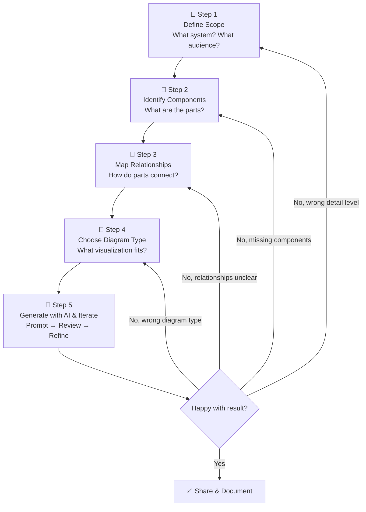
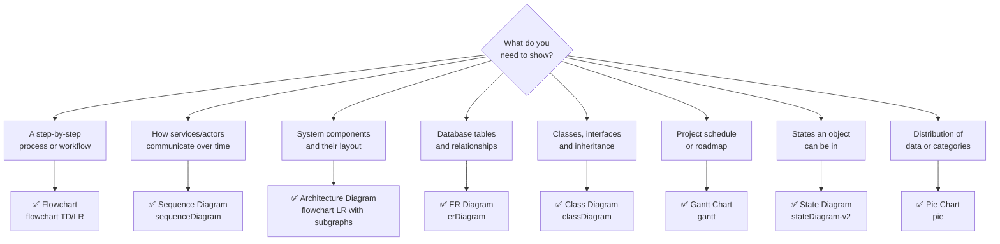
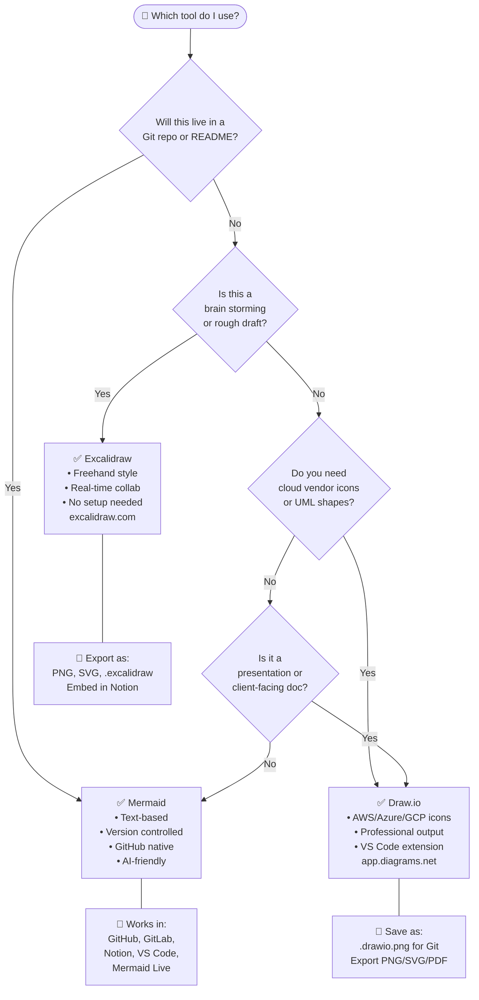

# 📋 SOP: Standard Operating Procedure for Architecture Drawing

A systematic, repeatable process for going from a blank page to a clear, useful architecture diagram — with or without AI.

---

## The 5-Step Framework



---

## Step 1: Define the Scope

**The #1 mistake:** Starting to draw before knowing what you're drawing.

### Questions to Answer

**1. What system are you diagramming?**
Be specific — not "our platform" but "the user authentication flow in our web app"

**2. What level of abstraction?**

| Level | Shows | Example |
|---|---|---|
| **L1 — Context** | System in its environment | "Our app talks to Google, Stripe, users" |
| **L2 — Container** | Major components | "Frontend, API, DB, Cache, Queue" |
| **L3 — Component** | Internal structure | "Auth module, Order module, Payment module" |
| **L4 — Code** | Classes/functions | "UserController, AuthService, JWTHelper" |

> 💡 **Rule of thumb:** Start at L2 (containers). Go to L3 only if someone needs implementation details.

**3. Who is the audience?**
- **Engineering team** → technical detail, show protocols, databases, APIs
- **Product/Management** → high-level flow, no implementation details
- **New hire onboarding** → show L2 overview + link to L3 details
- **Client/stakeholder** → business flow, user-friendly language

**4. What question does this diagram answer?**
- "How does the checkout process work?" → flowchart/sequence
- "What services do we run?" → architecture overview
- "How should our database be structured?" → ERD
- "What's the deployment timeline?" → Gantt

### Step 1 Checklist
- [ ] I can describe the system in one sentence
- [ ] I've chosen a specific abstraction level (L1/L2/L3/L4)
- [ ] I know who will read this diagram
- [ ] I know what question this diagram answers
- [ ] I can name the boundaries of the system (what's IN, what's OUT)

---

## Step 2: Identify Components

List everything that belongs in the diagram before drawing a single line.

### Component Categories

**For architecture diagrams:**
```
Clients:       Web browser, Mobile app, CLI, External API consumer
Gateways:      Load balancer, API Gateway, CDN, DNS
Services:      Each microservice or module
Databases:     SQL, NoSQL, Cache, Search index
Queues:        Kafka, RabbitMQ, SQS, Redis PubSub
Storage:       S3, file system, blob storage
External:      Third-party APIs (Stripe, SendGrid, Google Maps)
Infrastructure: Docker, Kubernetes, CI/CD
```

**For process/flow diagrams:**
```
Actors:        Who performs actions (User, Admin, System)
Actions:       What happens (Create order, Send email)
Decisions:     Where the flow branches (Is user logged in?)
States:        What state something is in (Pending, Processing, Done)
Triggers:      What starts the process (User clicks, Timer, Webhook)
Outputs:       What the process produces (Email, Record, File)
```

### Technique: Brain Dump First

Write a list, don't organize yet:
```
User → clicks checkout
Cart service
Inventory check
Payment service (Stripe)
Order created in DB
Email confirmation
Fraud detection
Load balancer
Redis for session
```

Then group and prioritize.

### Step 2 Checklist
- [ ] I've listed ALL components (even if I'll hide some later)
- [ ] I've identified which are internal vs external
- [ ] I've noted which are the critical path components
- [ ] I know which components to OMIT for this audience/level
- [ ] I've assigned each component a clear, short name

---

## Step 3: Map Relationships & Data Flow

Connect the components. For each pair: **how do they talk, and what flows between them?**

### Questions to Ask for Each Connection

1. **Does A communicate directly with B, or through C?**
2. **Is the communication synchronous (request/response) or async (event/fire-and-forget)?**
3. **What data flows from A to B?** (user ID, JSON payload, file, event)
4. **What protocol?** (REST, gRPC, WebSocket, SQL, message queue)
5. **Who initiates?** (A calls B, or B polls A, or event-driven)
6. **What happens on failure?** (retry, fallback, error response)

### Relationship Types

```
→  Synchronous call (REST API, gRPC, function call)
⇢  Async message (Kafka event, SQS message, webhook)
⟷  Bidirectional (WebSocket, bidirectional gRPC)
∈  Contains/belongs to (service inside VPC, module inside service)
```

### Data Flow Exercise

For each connection, write: `[Source] --[data/protocol]--> [Destination]`

Example:
```
Browser        --[HTTPS / JWT]--> API Gateway
API Gateway    --[REST / user_id]--> Auth Service
Auth Service   --[SQL]--> PostgreSQL
API Gateway    --[gRPC]--> Order Service
Order Service  --[Kafka event: order.created]--> Notification Service
Notification   --[SMTP]--> User's email
```

This list becomes your arrows in the diagram.

### Step 3 Checklist
- [ ] I've mapped a connection for every pair of interacting components
- [ ] I've labeled each connection (protocol + data type)
- [ ] I've identified synchronous vs async flows
- [ ] I've noted the direction of each flow (→ or ←)
- [ ] I've considered error/failure paths for critical connections
- [ ] I've identified bottlenecks or single points of failure

---

## Step 4: Choose the Right Diagram Type



### Diagram Type Quick Guide

| Diagram | Best for | Avoid when |
|---|---|---|
| **Flowchart** | Processes, decisions, user journeys | Showing timing/sequence between actors |
| **Sequence** | API flows, auth flows, service comm | Showing system layout |
| **Architecture (flowchart)** | System overview, component layout | Showing step-by-step process |
| **ERD** | Database schema design | Non-database relationships |
| **Class Diagram** | OOP design, code structure | Non-OOP systems |
| **Gantt** | Project timelines, sprints | Technical architecture |
| **State Diagram** | Order status, user sessions, state machines | Everything else |

### Multiple Diagrams for One System

A complex system needs **multiple diagrams at different levels**:

```
System: E-Commerce Platform
├── L2 Architecture Diagram    (overview of all services)
├── Sequence: Checkout Flow    (how services communicate for checkout)
├── Flowchart: Payment Logic   (decision tree for payment processing)
├── ERD: Database Schema       (tables and relationships)
└── State: Order Lifecycle     (pending → processing → shipped → delivered)
```

### Step 4 Checklist
- [ ] I've chosen the primary diagram type for this audience/question
- [ ] I've considered whether I need multiple diagrams
- [ ] I've chosen the direction (TD for processes, LR for architectures)
- [ ] I've decided on groupings (subgraphs, frames, swim lanes)

---

## Step 5: Generate with AI & Iterate

Now that you've done the thinking work, AI can do the drawing work.

### The Prompt Formula

A great diagram prompt has 5 parts:

```
1. DIAGRAM TYPE: "Generate a Mermaid flowchart LR..."
2. SYSTEM: "...for a URL shortener system..."
3. COMPONENTS: "...with these components: [your Step 2 list]..."
4. RELATIONSHIPS: "...where [your Step 3 list of connections]..."
5. CONSTRAINTS: "...Use subgraph for layers. Label arrows with protocol. Under 15 nodes."
```

### Full Example Prompt

```
Generate a Mermaid flowchart LR for a URL shortener system.

Components:
- Clients: Web browser, API consumer
- Edge: CloudFront CDN, Route 53 DNS
- App: 3x App Servers (auto-scaling group)
- Data: Redis cache (short_code → long_url, TTL 24h), PostgreSQL (urls table)
- Analytics: Kafka (click events), ClickHouse (aggregated data), Grafana dashboard

Relationships:
- Browser → DNS → CDN → Load Balancer → App Servers
- App Servers → Redis (read first)
- App Servers → PostgreSQL (on cache miss)
- App Servers → Kafka (publish click event)
- Kafka → ClickHouse → Grafana

Use subgraph to group: Clients, Edge Layer, App Layer, Data Layer, Analytics
Add emojis to component labels.
Label arrows with data type (HTTPS, SQL, events).
Output only valid Mermaid code.
```

### Iteration Strategy

**Round 1:** Get a working diagram, even if imperfect.
**Round 2:** Fix errors. Paste into https://mermaid.live — fix any parse errors.
**Round 3:** Add detail. "Add the error handling path when Redis is down"
**Round 4:** Simplify. "This is too complex — remove the analytics layer for the executive version"
**Round 5:** Polish. "Use consistent emoji for each component type"

### Prompts for Common Iterations

```
# Add missing component:
"Add a message queue between [A] and [B] that buffers events"

# Fix layout:
"Rearrange so that data flows left-to-right, with clients on the far left and databases on the far right"

# Simplify:
"This has too many nodes. Combine [A] and [B] into a single 'Backend' box"

# Add error paths:
"Add a dashed line showing what happens when [service] is unavailable"

# Multiple versions:
"Give me a simplified version (5 nodes) and a detailed version (15 nodes) of this diagram"
```

### Step 5 Checklist
- [ ] My prompt includes all 5 parts (type, system, components, relationships, constraints)
- [ ] I tested the generated code in https://mermaid.live
- [ ] The diagram answers the original question from Step 1
- [ ] The detail level matches the audience from Step 1
- [ ] All components from Step 2 are present (or intentionally omitted)
- [ ] All key relationships from Step 3 are shown
- [ ] I've shown at least one error/failure path
- [ ] Labels are clear and concise (< 30 chars per node)
- [ ] The diagram is readable at a glance (not too crowded)

---

## Tool Selection Decision Tree



---

## Complete SOP Example Walkthrough

**Scenario:** "I need to document how our new feature works for the team retrospective."

### Step 1 — Scope
- System: "User notification system — how we send in-app and email notifications when a comment is added"
- Level: L2 (containers, not code)
- Audience: Engineering team (can handle technical detail)
- Question: "How does a comment trigger notifications to all post followers?"

### Step 2 — Components
```
Actors: User (commenter), Post Followers
Services: Comment Service, Notification Service, User Service
Infrastructure: PostgreSQL (comments, followers), Kafka, Redis
External: SendGrid (email), Firebase (push notifications)
```

### Step 3 — Relationships
```
User → Comment Service: POST /comments (REST)
Comment Service → PostgreSQL: INSERT comment
Comment Service → Kafka: Publish comment.created event
Kafka → Notification Service: Consume comment.created
Notification Service → User Service: GET followers(post_id)
User Service → PostgreSQL: SELECT followers
Notification Service → Redis: Check notification preferences
Notification Service → SendGrid: Send email (for email pref)
Notification Service → Firebase: Send push (for mobile pref)
```

### Step 4 — Diagram Type
- Primary: Sequence diagram (shows timing and async message flow clearly)
- Secondary: Architecture flowchart (for overview of services)

### Step 5 — Prompt & Generate
```
Create a Mermaid sequenceDiagram for the following notification flow:

Participants: User, CommentService, Kafka, NotificationService, UserService, PostgreSQL, SendGrid, Firebase

Flow:
1. User POSTs /comments to CommentService
2. CommentService saves comment to PostgreSQL
3. CommentService publishes "comment.created" to Kafka (async)
4. CommentService returns 201 to User immediately
5. NotificationService consumes the Kafka event
6. NotificationService calls UserService to get list of post followers
7. UserService queries PostgreSQL for followers
8. NotificationService checks each follower's notification preferences in Redis
9. For followers with email preference: send via SendGrid
10. For followers with push preference: send via Firebase

Show the async boundary clearly with a Note.
Use -->> for async responses/events.
```

---

> ✅ Follow this SOP every time you need to create a diagram and you'll never stare at a blank page again.

> ➡️ Next: See the [prompt templates](README.md) for 20+ copy-paste AI prompts.
