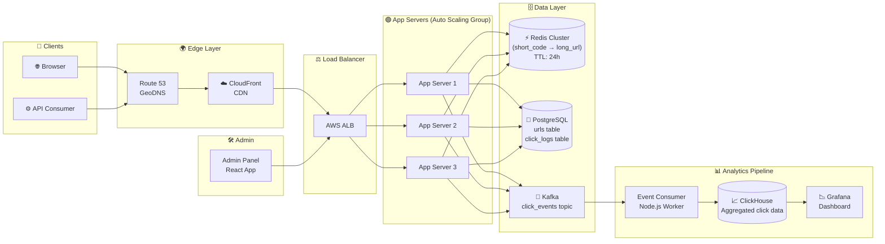
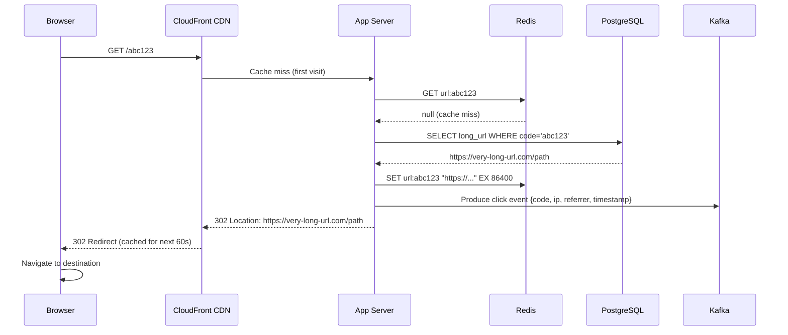
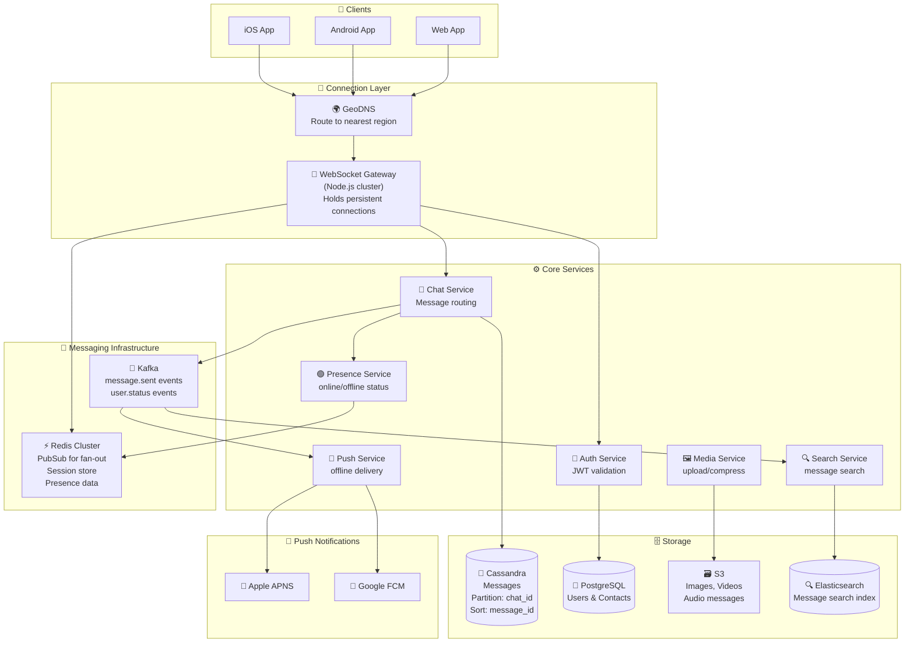
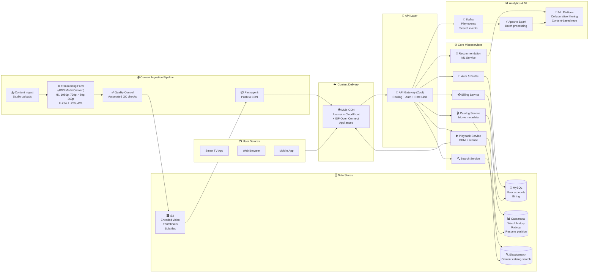
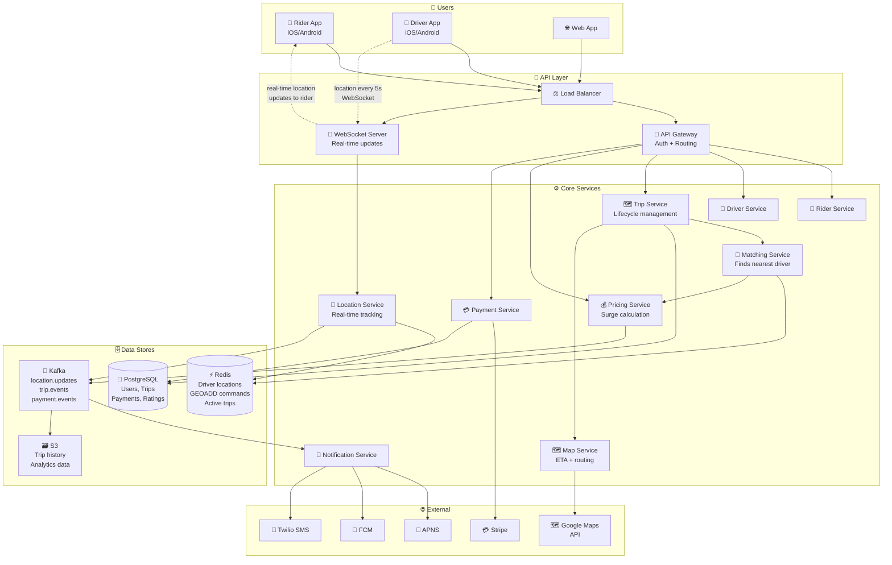
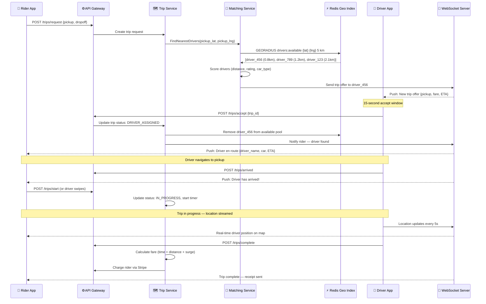

# 🌍 Real-World Architecture Case Studies

Four production-level system designs with complete Mermaid diagrams and detailed design decisions.

---

## Case Study 1: URL Shortener (like bit.ly)

### Overview
A URL shortener takes a long URL and returns a short one (e.g., `bit.ly/abc123`). When a user visits the short URL, they're redirected to the original. The key challenge is handling **billions of redirects** with sub-10ms latency.

### Key Design Decisions

| Decision | Choice | Reason |
|---|---|---|
| ID generation | Base62 encoding | 6 chars = 56 billion unique URLs |
| Storage | PostgreSQL + Redis | SQL for durability, Redis for fast reads |
| Redirect type | 301 vs 302 | 302 (temporary) — allows analytics tracking |
| Scaling | Horizontal app servers | Each is stateless, easy to scale |
| Analytics | Async via Kafka | Don't slow down the redirect path |
| Custom domains | Multi-tenant routing | Enterprise feature (CNAME support) |

### Architecture Diagram

### Short URL Redirect Flow

---

## Case Study 2: Chat Application (like WhatsApp)

### Overview
A real-time messaging app supporting billions of users. The core challenge: **persistent WebSocket connections** across a distributed server fleet, ensuring messages are delivered even when sender and receiver connect to different servers.

### Key Design Decisions

| Decision | Choice | Reason |
|---|---|---|
| Transport | WebSocket | Bidirectional, low-overhead persistent connection |
| Message routing | Redis PubSub | Fan-out messages across server instances |
| Message storage | Cassandra | Write-heavy, time-series, scales horizontally |
| Offline delivery | Push notifications | APNS + FCM when WebSocket is closed |
| Media | Separate service + S3 | Keep chat service lightweight |
| Message ordering | Snowflake IDs | Globally unique, time-sortable IDs |
| End-to-end encryption | Signal Protocol | Client-side encryption, server can't read |

### Architecture Diagram

---

## Case Study 3: Video Streaming (like Netflix)

### Overview
A video streaming platform that serves high-quality video to 200M+ users globally. The key challenge: **content delivery at massive scale** with adaptive bitrate streaming and zero buffering.

### Key Design Decisions

| Decision | Choice | Reason |
|---|---|---|
| Video encoding | Multiple bitrates | Adaptive bitrate (ABR) — adjusts to connection speed |
| Format | MPEG-DASH / HLS | Industry standard streaming protocols |
| Storage | S3 + CDN | Store once, serve globally from edge |
| CDN strategy | Multi-CDN | Akamai + CloudFront + own ISP caches (Open Connect) |
| Recommendation | ML pipeline | User behavior → personalized homepage |
| Metadata | Cassandra | Movie catalog, user watch history |
| Search | Elasticsearch | Full-text search across 15,000+ titles |

### Architecture Diagram

---

## Case Study 4: Ride-Sharing (like Uber)

### Overview
A ride-sharing platform connecting riders and drivers in real-time. The core challenge: **geospatial matching at scale** — finding the nearest available driver to a rider in milliseconds, across millions of concurrent drivers worldwide.

### Key Design Decisions

| Decision | Choice | Reason |
|---|---|---|
| Location tracking | Driver app sends location every 5s | Balance accuracy vs battery/bandwidth |
| Driver location index | Redis Geospatial (GEOADD) | O(log N) radius searches, in-memory speed |
| Matching algorithm | Bipartite graph matching | Optimal assignment of riders to drivers |
| Surge pricing | ML model | Demand/supply ratio → dynamic pricing |
| Trip data | PostgreSQL | ACID transactions for financial records |
| Maps | In-house (Uber) or Google Maps API | Navigation, ETAs, routing |
| Payments | Internal + Stripe | PCI compliance, multi-currency |

### Architecture Diagram

### The Matching Algorithm Flow

---

## Summary: Design Pattern Comparison

| System | Read/Write | Key Challenge | Solution |
|---|---|---|---|
| **URL Shortener** | Read-heavy (1000:1) | Low latency redirects | Redis cache + CDN |
| **Chat App** | Write-heavy, real-time | Message fan-out at scale | WebSocket + Redis PubSub |
| **Video Streaming** | Read-heavy, large files | Global content delivery | Multi-CDN + ABR encoding |
| **Ride-sharing** | Real-time, geospatial | Driver-rider matching | Redis Geo + WebSocket |

---

> 💡 **Want to design your own?** Use the [AI prompt templates](../04-ai-prompts/README.md) and the [SOP framework](../04-ai-prompts/sop.md) to design any system step-by-step.
