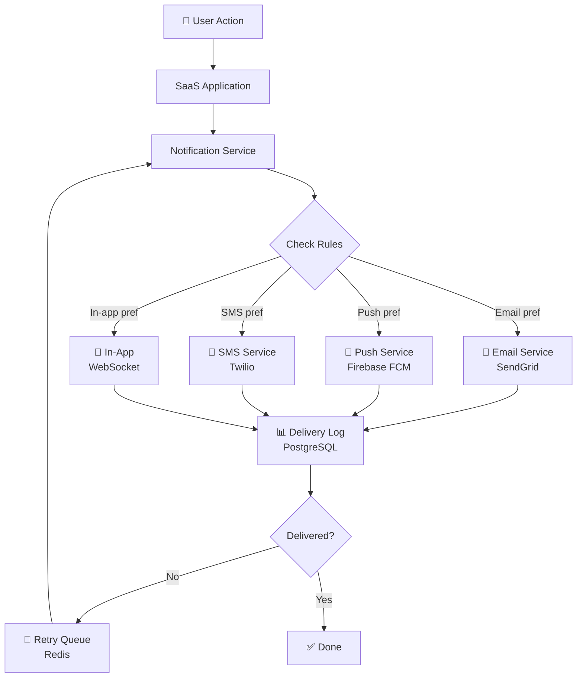
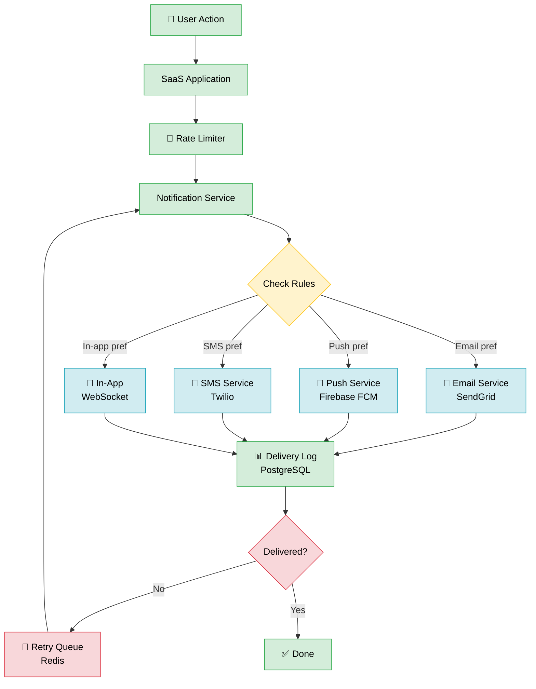

# 🤖 AI Prompt Chain — The 3-Prompt Strategy

> **Clarify → Generate → Refine.** Three prompts, five minutes, professional diagram.

Never start with a blank canvas. Always start with a conversation.

---

## Why 3 Prompts?

Most people try to write one giant prompt and get a mediocre diagram. The 3-prompt chain works because:

1. **Clarifier** — forces you to think before you type
2. **Generator** — gives the AI the exact structure it needs to produce valid Mermaid
3. **Refiner** — surgical edits without regenerating from scratch

---

## PROMPT 1 — The Clarifier

Use this before you know exactly what to draw. It helps you discover the right diagram type and scope.

```
I want to document [SYSTEM/FEATURE]. Help me plan the diagram:
1. What diagram type fits best (flowchart, sequence, architecture, ER)?
2. What are the 5-10 key components I must include?
3. What is the main flow or relationship to highlight?
4. What level of detail suits [AUDIENCE: developers / managers / designers]?

Context: [paste your notes or description here]
```

**When to use:** You have a vague idea but aren't sure where to start.

**Example:** Replace `[SYSTEM/FEATURE]` with "user authentication system", `[AUDIENCE]` with "developers", and paste your notes after Context.

---

## PROMPT 2 — The Generator

One template per diagram type. Copy the one you need, fill in the blanks, send to AI.

### Flowchart Template

```
Generate a Mermaid flowchart diagram for the following system:

System: [name]
Main flow: [describe the happy path step by step]
Decision points: [list the if/else forks]
Error paths: [what happens when things go wrong]
External systems: [any third-party services or APIs]

Requirements:
- Use flowchart TD (top-down) direction
- Use emoji labels for major nodes (👤 user, 🗄️ database, ⚙️ service)
- Show at least one error/retry path
- Keep node IDs short (2-4 chars)
- Add subgraphs if there are distinct layers

Output: valid Mermaid code only, no explanation.
```

### Sequence Diagram Template

```
Generate a Mermaid sequence diagram for the following interaction:

System: [name]
Participants: [list all actors/systems in order of involvement]
Main flow:
  1. [first action]
  2. [second action]
  3. [etc.]
Async calls: [which calls are async / fire-and-forget]
Error scenarios: [what failure cases to show]

Requirements:
- Use sequenceDiagram syntax
- Mark async with ->> and sync with ->
- Use activate/deactivate for long operations
- Add alt blocks for error paths
- Add Notes where helpful

Output: valid Mermaid code only, no explanation.
```

### Architecture / System Diagram Template

```
Generate a Mermaid architecture diagram for the following system:

System: [name + one-line description]
Layers:
  - Frontend: [components]
  - Backend: [services]
  - Data: [databases, caches, queues]
  - External: [third-party APIs]
Key data flows: [describe main data paths between components]
Scale indicators: [any load balancers, CDNs, replicas to show]

Requirements:
- Use flowchart LR (left-right) or TD as appropriate
- Group related components in subgraphs
- Label all arrows with the protocol or data type (HTTP, gRPC, SQL, etc.)
- Use emoji to distinguish component types

Output: valid Mermaid code only, no explanation.
```

### ER Diagram Template

```
Generate a Mermaid ER diagram for the following data model:

System: [name]
Entities: [list all tables/entities]
Key attributes per entity: [list 3-5 important fields each]
Relationships:
  - [Entity A] has [one/many] [Entity B] via [field]
  - [add more...]
Cardinality rules: [any specific one-to-one, one-to-many, many-to-many]

Requirements:
- Use erDiagram syntax
- Show PK and FK fields explicitly
- Include cardinality notation (||--o{, }|--|{, etc.)
- Only show the most important attributes (not every column)

Output: valid Mermaid code only, no explanation.
```

### Class Diagram Template

```
Generate a Mermaid class diagram for the following codebase:

System: [name]
Classes: [list all classes]
Key methods per class: [2-4 per class]
Key attributes per class: [2-4 per class]
Relationships:
  - [ClassA] inherits [ClassB]
  - [ClassC] uses [ClassD]
  - [ClassE] implements [InterfaceF]

Requirements:
- Use classDiagram syntax
- Show visibility (+public, -private, #protected)
- Include inheritance (--|>), composition (*--), and dependency (..>)
- Group with namespaces if there are more than 6 classes

Output: valid Mermaid code only, no explanation.
```

---

## PROMPT 3 — The Refiners

Run these on an existing diagram. Always paste your current Mermaid code first.

### Add Detail

```
Here is my current Mermaid diagram:

[paste diagram]

Please add:
- [specific detail 1, e.g. "a retry queue between the email service and dead-letter store"]
- [specific detail 2, e.g. "rate limiting node before the API gateway"]
- [specific detail 3]

Keep the existing structure. Only add the new nodes and connections. Output valid Mermaid only.
```

### Simplify for Non-Tech Audience

```
Here is my current Mermaid diagram:

[paste diagram]

Simplify this for a non-technical audience (managers / executives):
- Replace technical terms with plain English labels
- Remove implementation details (no database names, no protocol labels)
- Keep only the user-facing flow
- Maximum 8 nodes total
- Use friendly emoji

Output valid Mermaid only.
```

### Add Colour Coding

```
Here is my current Mermaid diagram:

[paste diagram]

Add colour coding using Mermaid's classDef syntax:
- Green (#d4edda, stroke #28a745) = happy path / success states
- Red (#f8d7da, stroke #dc3545) = error states / failure paths
- Blue (#d1ecf1, stroke #17a2b8) = external systems / third-party services
- Yellow (#fff3cd, stroke #ffc107) = decision points / conditions
- Grey (#e2e3e5, stroke #6c757d) = background / storage

Apply the appropriate class to each node. Output valid Mermaid only.
```

### Convert Diagram Type

```
Here is my current Mermaid diagram:

[paste diagram]

Convert this to a [TARGET TYPE: sequence diagram / ER diagram / flowchart / class diagram].

Preserve all the same components and relationships, just expressed in the new diagram type.
Output valid Mermaid only.
```

### Export-Ready Cleanup

```
Here is my current Mermaid diagram:

[paste diagram]

Clean it up for export / publication:
- Fix any syntax issues
- Ensure all node IDs are unique and meaningful (no single letters)
- Shorten overly long labels (max 30 chars per label)
- Check all arrow directions are consistent
- Add a title using the %%{init: {'theme': 'default'}}%% block if missing
- Ensure subgraphs have clear titles

Output valid Mermaid only.
```

---

## Full Worked Example: User Notification System

Let's walk through all three prompts end to end.

### Step 1 — Send the Clarifier Prompt

**You send:**
```
I want to document a user notification system. Help me plan the diagram:
1. What diagram type fits best (flowchart, sequence, architecture, ER)?
2. What are the 5-10 key components I must include?
3. What is the main flow or relationship to highlight?
4. What level of detail suits developers?

Context: We have a SaaS app. When users take actions (like completing a task or receiving a mention),
the system sends notifications via email, push, SMS, or in-app — based on user preferences.
There's also a retry queue for failed deliveries.
```

**AI responds:**
```
Great system to diagram! Here's my recommendation:

1. Diagram type: Flowchart (TD) — best for showing decision branching by user preference.
   A sequence diagram would also work if you want to show timing between services.

2. Key components to include:
   - User Action (trigger)
   - SaaS Application (event publisher)
   - Notification Service (orchestrator)
   - User Preferences / Rules engine (decision point)
   - Email Service (e.g. SendGrid)
   - Push Service (e.g. Firebase FCM)
   - SMS Service (e.g. Twilio)
   - In-App / WebSocket channel
   - Delivery Log (e.g. PostgreSQL)
   - Retry Queue (e.g. Redis)

3. Main flow: User action → app emits event → notification service checks preferences
   → routes to correct channel → logs delivery → retries on failure.

4. For developers: include service names (SendGrid, Firebase, Twilio, Redis),
   show the retry loop explicitly, label the decision branches.
```

---

### Step 2 — Send the Generator Prompt

**You send:**
```
Generate a Mermaid flowchart diagram for the following system:

System: User Notification System
Main flow: User performs action → SaaS app emits event → Notification Service receives event
  → checks user preferences → routes to appropriate channel → logs delivery result
Decision points: User preference (email / push / SMS / in-app), Delivery success (yes/no)
Error paths: Failed delivery → retry queue → re-attempt via Notification Service
External systems: SendGrid (email), Firebase FCM (push), Twilio (SMS)

Requirements:
- Use flowchart TD direction
- Use emoji labels for major nodes
- Show the retry path
- Keep node IDs short

Output: valid Mermaid code only, no explanation.
```

**AI generates:**



---

### Step 3 — Send the Refiner Prompt

You want to add colour coding and a rate limiter. Send:

**You send:**
```
Here is my current Mermaid diagram:

flowchart TD
    User[👤 User Action] --> App[SaaS Application]
    App --> NS[Notification Service]
    NS --> Rules{Check Rules}
    Rules -->|Email pref| Email[📧 Email Service\nSendGrid]
    Rules -->|Push pref| Push[📱 Push Service\nFirebase FCM]
    Rules -->|SMS pref| SMS[📱 SMS Service\nTwilio]
    Rules -->|In-app pref| IA[🔔 In-App\nWebSocket]
    Email & Push & SMS & IA --> Log[📊 Delivery Log\nPostgreSQL]
    Log --> Retry{Delivered?}
    Retry -->|No| RetryQ[🔄 Retry Queue\nRedis]
    RetryQ --> NS
    Retry -->|Yes| Done[✅ Done]

Please add:
- A rate limiter node between App and NS
- Colour coding: green = happy path, red = error/retry, blue = external services, yellow = decisions

Output valid Mermaid only.
```

**AI generates (refined):**



---

## The AI Context Template

Copy this block at the start of any complex prompt for best results:

```
System: [name + one-line description]
Audience: [who reads this]
Diagram type: [flowchart / sequence / architecture / ER]
Key components: [list 5-10]
Main flow: [happy path in 2-3 sentences]
Edge cases: [2-3 edge cases to show]
Style: [minimal / detailed / colour-coded]
Target platform: [GitHub / Draw.io / Excalidraw / Notion]
```

The more context you give, the less back-and-forth you'll need.

---

## Quick Reference

**Situation** | **Use**
--- | ---
Don't know what to draw | Prompt 1 — Clarifier
Know what to draw | Prompt 2 — Generator (pick the right type)
Diagram exists, need changes | Prompt 3 — Refiner (pick the right variant)
Need to present to exec | Prompt 3 — Simplify
Need to publish to GitHub | Prompt 3 — Export-ready cleanup
