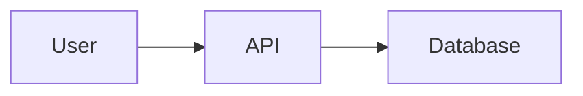

# 🔄 Platform Conversion — Mermaid to Everywhere

> You write it once in Mermaid. You deliver it anywhere.

---

## Conversion Quick Reference

**From** | **To** | **Method** | **Steps** | **Time**
--- | --- | --- | --- | ---
Mermaid | mermaid.live | Paste code | 1 | 10 sec
Mermaid | Draw.io | Arrange → Insert → Mermaid | 2 | 30 sec
Mermaid | Excalidraw | + → Mermaid | 2 | 20 sec
Mermaid | GitHub | ` ```mermaid ` block | 1 | 5 sec
Mermaid | Notion | /code → Mermaid | 2 | 15 sec
Mermaid | Figma | Plugin → Mermaid in Figma | 4 | 1 min
Mermaid | VS Code | Preview shortcut | 1 | 5 sec
Mermaid | Confluence | Plugin → Insert Mermaid | 3 | 1 min
Mermaid | Slides (Marp) | VS Code + Marp extension | 2 | 2 min

---

## Mermaid → mermaid.live

The simplest path — great for quick PNG/SVG exports.

1. Go to [mermaid.live](https://mermaid.live)
2. Paste your Mermaid code into the left panel
3. Diagram renders instantly on the right
4. Click **Download PNG** or **Download SVG**

**Pro tip:** Share the URL — it encodes your diagram in the link.

---

## Mermaid → Draw.io

Draw.io has **native Mermaid import** — no plugins needed.

1. Open [app.diagrams.net](https://app.diagrams.net)
2. In the menu: **Arrange → Insert → Mermaid**
   - Alternatively: click the **+** icon in the toolbar → select **Mermaid**
3. Paste your Mermaid code into the dialog → click **Insert**
4. The diagram is auto-created as editable shapes on the canvas
5. Fit to screen: **Ctrl+Shift+H** (Mac: **⌘⇧H**)
6. Export: **File → Export As → PNG / SVG / PDF / XML**

**Edit after import:** Select the diagram shape → press **Enter** to re-open the Mermaid editor. Make changes → click **Apply**.

**Alternative path (desktop app):** Arrange → Insert → Advanced → Mermaid

---

## Mermaid → Excalidraw

Excalidraw has built-in Mermaid import via the `@excalidraw/mermaid-to-excalidraw` library.

1. Go to [excalidraw.com](https://excalidraw.com)
2. Click the **+** button in the toolbar (top left area) → choose **Mermaid to Excalidraw**
   - Or open the hamburger menu → **Insert** → **Mermaid to Excalidraw**
3. Paste your Mermaid code → click **Insert**
4. The diagram appears as native Excalidraw elements (fully editable)
5. Select all (**Ctrl+A**) → reposition / resize as needed
6. Export: **Ctrl+Shift+E** → choose PNG, SVG, or `.excalidraw`

**Note:** After import, elements are fully editable Excalidraw shapes — you can change style, add hand-drawn texture, collaborate in real-time.

**Tip:** Try the conversion playground at [mermaid-to-excalidraw.vercel.app](https://mermaid-to-excalidraw.vercel.app)

---

## Mermaid → GitHub README

GitHub has rendered Mermaid natively since 2022 — zero setup required.

Just wrap your code in a fenced code block with the `mermaid` language tag:

````markdown

````

**Works in:**
- README.md files
- GitHub Issues
- Pull Requests
- GitHub Discussions
- GitHub Wiki pages

**No plugin or configuration needed.** It just renders.

---

## Mermaid → Notion

Notion has **native Mermaid support** in Code blocks — no extension required.

1. In any Notion page, type `/code` → select **Code** block
2. Click the language selector (top-right of the block) → choose **Mermaid**
3. Paste your Mermaid code
4. The block shows a live preview below the code
5. Toggle between **Code**, **Preview**, or **Split** view

**Tip:** Use Split view during editing — you see code and diagram side by side.

---

## Mermaid → Figma

Several community plugins handle this:

### Option A — Mermaid in Figma (image-based)
1. In Figma: **Main menu → Plugins → Community**
2. Search for **"Mermaid in Figma"** ([plugin link](https://www.figma.com/community/plugin/1326922376721037678))
3. Install and run the plugin
4. Create a text object with your Mermaid code, select it, run the plugin → generates an image

### Option B — Mermaid to Flow (FigJam, editable shapes)
1. In Figma: **Main menu → Plugins → Community**
2. Search for **"Mermaid-to-Flow"** ([plugin link](https://www.figma.com/community/plugin/1515823722187210177))
3. Install and run → paste Mermaid code → generates editable FigJam flowchart with smart layout and colour coding

### Option C — Mermaid to FigJam (bidirectional)
- Plugin: [Mermaid to FigJam](https://www.figma.com/community/plugin/1515624006157749329) — v3.0 supports FigJam → Mermaid conversion too

**Note:** All these produce static shapes in Figma — they do not live-update if you change the Mermaid code. Re-run the plugin to regenerate.

---

## Mermaid → VS Code

1. Install the extension: **[Markdown Preview Mermaid Support](https://marketplace.visualstudio.com/items?itemName=bierner.markdown-mermaid)**
2. In any `.md` file, open preview: **Ctrl+Shift+V** (Mac: **⌘⇧V**)
3. Mermaid code blocks render live in the preview pane
4. Side-by-side: **Ctrl+K V** — opens preview next to editor

**Also built in:** VS Code's built-in Markdown preview now renders Mermaid natively in recent versions.

---

## Mermaid → Confluence

1. Install **[Mermaid Diagrams for Confluence](https://marketplace.atlassian.com/apps/1225042)** from the Atlassian Marketplace (admin required)
2. In a page: **Insert → Mermaid Diagram** (or search "Mermaid" in the insert menu)
3. Paste your code → **Insert**
4. Publish the page — the diagram renders in view mode

---

## Mermaid → Slides (Marp)

Turn your Mermaid diagrams into presentation slides.

1. Install VS Code extension: **[Marp for VS Code](https://marketplace.visualstudio.com/items?itemName=marp-team.marp-vscode)**
2. Start your `.md` file with the Marp frontmatter:

```markdown
---
marp: true
theme: default
---
```

3. Use Mermaid blocks normally — they render in slides
4. Preview: open command palette **Ctrl+Shift+P** → **"Marp: Open Preview"**
5. Export: **Ctrl+Shift+P** → **"Marp: Export Slide Deck"** → choose PDF, HTML, PPTX, or PNG

---

## Universal Diagram Converter

If you need to convert between formats (Mermaid ↔ Draw.io ↔ Excalidraw) try:
- [diagram-bridge-project-new.vercel.app](https://diagram-bridge-project-new.vercel.app) — community-built converter for all three formats

---

## Choosing the Right Export Format

**Use case** | **Best format**
--- | ---
Embed in GitHub / docs | Mermaid code block (renders natively)
Email / Slack / doc attachment | PNG (universal, no dependencies)
Scalable for presentations | SVG (crisp at any size)
Further editing in vector tool | SVG or .excalidraw
Archive / source of truth | XML (Draw.io) or .excalidraw
Print-ready | PDF (via Draw.io export)
