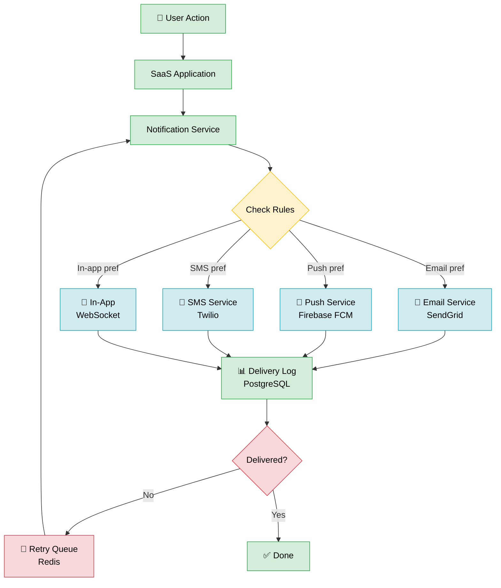
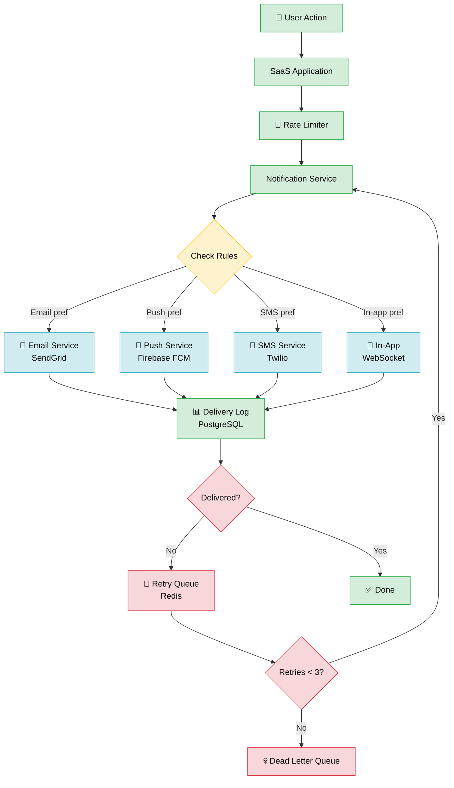

# 🎬 Real Session Demo — 5 Minutes, Zero to Shareable Diagram

> **Scenario:** Design a user notification system for a SaaS app.
> **Timer:** 5 minutes.
> **Tools:** ChatGPT → mermaid.live → Draw.io → GitHub

Follow along. Every prompt and every piece of Mermaid code is real and copy-pasteable.

---

## 0:00 — Step 1: Clarifier Prompt

Don't open any diagram tool yet. Open your AI chat first.

**You type:**

```
I want to document a user notification system for a SaaS app. Help me plan the diagram:
1. What diagram type fits best (flowchart, sequence, architecture, ER)?
2. What are the 5-10 key components I must include?
3. What is the main flow or relationship to highlight?
4. What level of detail suits developers?

Context: When users perform actions (complete a task, receive a mention, hit a deadline),
the app triggers notifications. Users have preferences: email, push, SMS, or in-app.
Failed deliveries go into a retry queue. We use SendGrid, Firebase FCM, and Twilio.
```

**AI responds (realistic output):**

```
Great system! Here's my recommendation:

1. Diagram type: Flowchart (TD — top down)
   Rationale: You have a clear trigger → branching → outcome pattern.
   A sequence diagram would work too if you want to show timing between services.

2. Key components (8 core nodes):
   - User Action (trigger event)
   - SaaS Application (event emitter)
   - Rate Limiter (protect downstream services)
   - Notification Service (orchestrator)
   - User Preference Rules (decision point)
   - Email Service → SendGrid
   - Push Service → Firebase FCM
   - SMS Service → Twilio
   - In-App Channel → WebSocket
   - Delivery Log → PostgreSQL
   - Retry Queue → Redis

3. Main flow to highlight:
   User action → app emits event → rate limiter → notification service →
   checks preferences → routes to channel → logs result → retries if failed

4. For developers: include service names (SendGrid, Firebase, Twilio, Redis),
   show the retry loop explicitly, label decision branches by preference type.
   Consider colour-coding: green=happy path, red=retry/error, blue=external.
```

**⏱ Time elapsed: 30 seconds**

---

## 0:30 — Step 2: Generator Prompt

Now you know exactly what to build. Send the Generator prompt.

**You type:**

```
Generate a Mermaid flowchart diagram for the following system:

System: User Notification System for a SaaS app
Main flow: User performs action → SaaS app emits event → Rate limiter checks quota →
  Notification Service receives event → checks user preferences → routes to correct channel →
  logs delivery result → retries on failure
Decision points:
  - User preference (email / push / SMS / in-app)
  - Delivery success (yes / no)
Error paths: Failed delivery → Retry Queue (Redis) → re-attempt via Notification Service
External systems: SendGrid (email), Firebase FCM (push), Twilio (SMS)

Requirements:
- flowchart TD direction
- Emoji labels on major nodes
- Show the retry loop
- Colour-code: green=happy path, red=retry/error, blue=external services, yellow=decisions
- Node IDs: short (2-4 chars)

Output: valid Mermaid code only, no explanation.
```

**AI generates:**



**⏱ Time elapsed: 1:00**

---

## 1:30 — Step 3: Review in mermaid.live

Go to [mermaid.live](https://mermaid.live). Paste the code into the left panel.

**What to check:**
- [ ] All nodes render (no syntax errors in the right panel)
- [ ] Arrows flow in the right direction
- [ ] Labels are readable (not truncated)
- [ ] Colour coding looks right
- [ ] The retry loop is clearly visible

**Monaco editor tips (the code editor on the left):**
- `Ctrl+/` — toggle line comment (useful to disable a node temporarily)
- `Ctrl+Z` — undo changes
- `Ctrl+Shift+P` — command palette (format, find, etc.)
- `Ctrl+F` — find text in the diagram code
- `Alt+Shift+F` — auto-format the Mermaid code

**If something looks wrong:** Note the issue, then fix it with a Refiner prompt (next step).

**⏱ Time elapsed: 2:00**

---

## 2:00 — Step 4: Refinement Prompt

The rate limiter node is missing. The retry count should be visible. Let's fix both.

**You type:**

```
Here is my current Mermaid diagram:

flowchart TD
    classDef happy fill:#d4edda,stroke:#28a745,color:#000
    classDef error fill:#f8d7da,stroke:#dc3545,color:#000
    classDef external fill:#d1ecf1,stroke:#17a2b8,color:#000
    classDef decision fill:#fff3cd,stroke:#ffc107,color:#000

    User[👤 User Action] --> App[SaaS Application]
    App --> NS[Notification Service]
    NS --> Rules{Check Rules}
    Rules -->|Email pref| Email[📧 Email Service\nSendGrid]
    Rules -->|Push pref| Push[📱 Push Service\nFirebase FCM]
    Rules -->|SMS pref| SMS[📱 SMS Service\nTwilio]
    Rules -->|In-app pref| IA[🔔 In-App\nWebSocket]
    Email & Push & SMS & IA --> Log[📊 Delivery Log\nPostgreSQL]
    Log --> Retry{Delivered?}
    Retry -->|No| RetryQ[🔄 Retry Queue\nRedis]
    RetryQ --> NS
    Retry -->|Yes| Done[✅ Done]

    class User,App,NS,Log,Done happy
    class Retry,RetryQ error
    class Email,Push,SMS,IA external
    class Rules decision

Please add:
- A Rate Limiter node (🚦) between App and NS, styled happy
- A Max Retries decision after RetryQ: if retries < 3, go back to NS; if >= 3, go to Dead Letter Queue (💀 DLQ node), styled error

Keep everything else the same. Output valid Mermaid only.
```

**AI generates (refined):**



Paste this into mermaid.live. Looks great. ✅

**⏱ Time elapsed: 3:00**

---

## 3:00 — Step 5: Convert to Draw.io

Now let's get a polished, exportable version in Draw.io.

1. Open [app.diagrams.net](https://app.diagrams.net) → **Create new diagram**
2. In the menu: **Arrange → Insert → Mermaid**
3. Paste the refined Mermaid code → click **Insert**
4. Press **Ctrl+Shift+H** — fits the diagram to screen
5. Optional polish:
   - Click on the diagram → press **Enter** to re-open Mermaid editor for tweaks
   - Right-click canvas → **Select Edges** → change connector style if needed
   - Drag nodes to adjust spacing if auto-layout is cramped
6. Export: **File → Export As → PNG** → set scale to 2x for high-res

**Hotkeys used in this step:**
- `Ctrl+Shift+H` — fit to screen after import
- `Enter` (on selected diagram) — re-open Mermaid editor
- `Ctrl+S` — save as Draw.io XML (keep the source!)
- `Ctrl+Shift+X` — export dialog

**⏱ Time elapsed: 4:00**

---

## 4:00 — Step 6: Export PNG + Embed in GitHub

**Export from mermaid.live:**
1. Click **Download PNG** (top right of preview panel)
2. Or **Download SVG** for scalable version

**Embed in GitHub README:**

Add the Mermaid code directly — GitHub renders it natively:

````markdown
## 🔔 Notification System Architecture


````

**Result:** Push this to GitHub and the diagram renders natively in your README — no image hosting, no CDN, no extra tools.

**⏱ Total time: ~5 minutes** ✅

---

## 🎯 Summary — The 5-Minute Formula

**Step** | **Action** | **Tool** | **Time**
--- | --- | --- | ---
1 | Clarifier prompt | AI chat | 30 sec
2 | Generator prompt | AI chat | 30 sec
3 | Review + check | mermaid.live | 1 min
4 | Refiner prompt (if needed) | AI chat | 1 min
5 | Convert to target tool | Draw.io / Excalidraw | 1 min
6 | Export + embed | GitHub / Notion / Docs | 30 sec
**Total** | | | **~5 min**

---

## 📋 The AI Context Template (Copy-Paste)

Use this at the start of any diagram session to prime the AI with maximum context:

```
System: [name + one-line description]
Audience: [developers / managers / designers]
Diagram type: [flowchart / sequence / architecture / ER]
Key components: [list them]
Main flow: [describe in 2 sentences]
Edge cases: [list 2-3]
Style: [minimal / detailed / colour-coded]
Output platform: [GitHub / Draw.io / Excalidraw / Notion / Figma]
```

**Example (filled in):**

```
System: User Notification System — routes SaaS app events to email/push/SMS/in-app channels
Audience: Backend developers
Diagram type: flowchart
Key components: User Action, SaaS App, Rate Limiter, Notification Service, Preference Rules,
  SendGrid, Firebase FCM, Twilio, WebSocket, Delivery Log (PostgreSQL), Retry Queue (Redis), DLQ
Main flow: User action triggers an event in the app, which passes through rate limiting and is
  routed by the notification service based on user preferences to the appropriate channel.
  All deliveries are logged; failures are retried up to 3 times before going to the DLQ.
Edge cases: Rate limit exceeded (drop or queue), max retries hit (DLQ), user has no preference set
Style: colour-coded (green=happy path, red=error, blue=external, yellow=decision)
Output platform: GitHub README
```

The more you fill in, the better the first-pass diagram — and the less refining you'll need.
