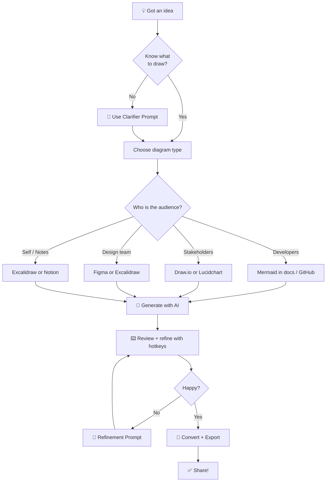
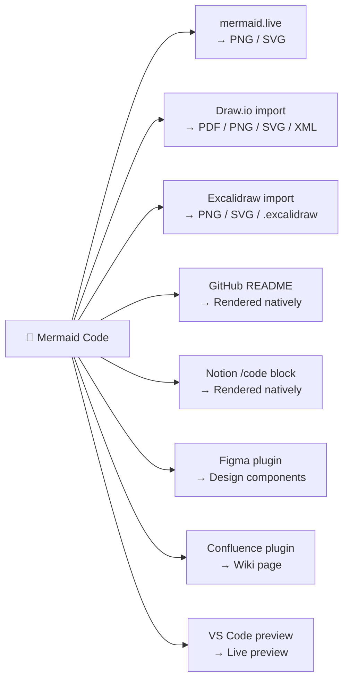

# ⚡ Build with AI — The Complete Speed Workflow

> From idea to shareable diagram in 5 minutes, not 2 hours.

## The Problem

Traditional diagramming:
- Open tool → drag boxes → connect arrows → resize → align → format text → 2 hours later → still looks bad 😭

AI-first diagramming:
- Describe idea → AI generates → review → export → done ✅

## The Speed Formula

**Step** | **Action** | **Time**
--- | --- | ---
1 | Use AI Clarifier Prompt | 30 sec
2 | Generate Mermaid with AI | 30 sec
3 | Review in mermaid.live | 1 min
4 | Refine with AI if needed | 1 min
5 | Convert to target platform | 1 min
6 | Export and share | 30 sec
**Total** | | **~5 min**

## The Decision Flowchart

## Chapters in This Section

**File** | **What you'll learn**
--- | ---
[01 - AI Prompt Chain](./01-ai-prompt-chain.md) | The 3-prompt strategy: clarify → generate → refine
[02 - Platform Conversion](./02-platform-conversion.md) | Mermaid → Draw.io, Excalidraw, Figma, Notion, GitHub
[03 - Hotkeys Cheatsheet](./03-hotkeys-cheatsheet.md) | Speed shortcuts for every tool
[04 - Real Session Demo](./04-real-session-demo.md) | Watch a full 5-min session, copy the prompts

## The Conversion Map

---

> ⭐ **New to this repo?** Start here — this chapter ties everything together.
