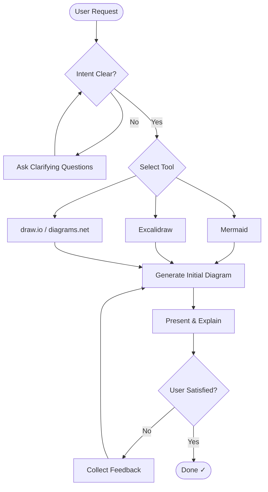
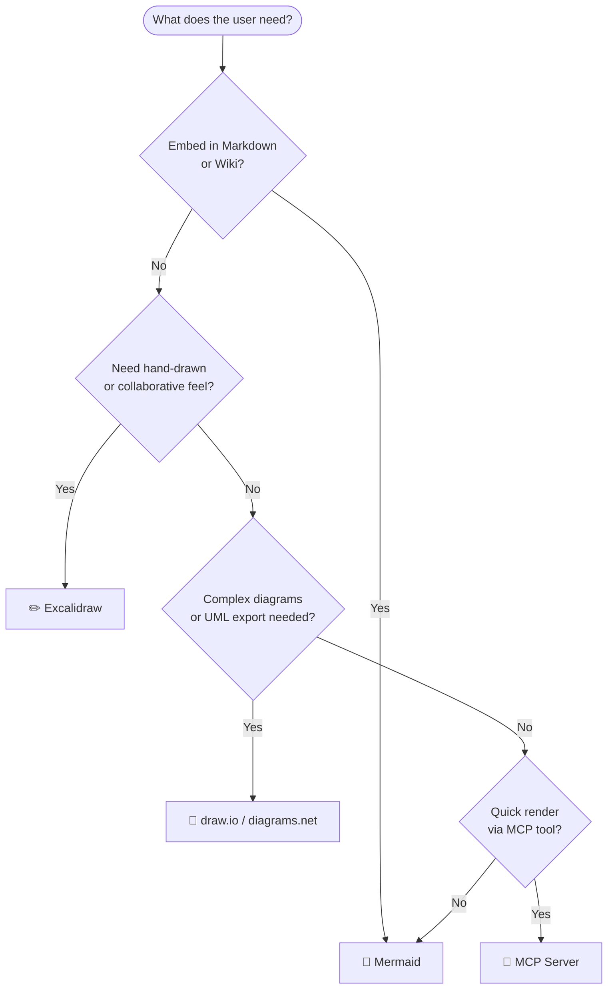
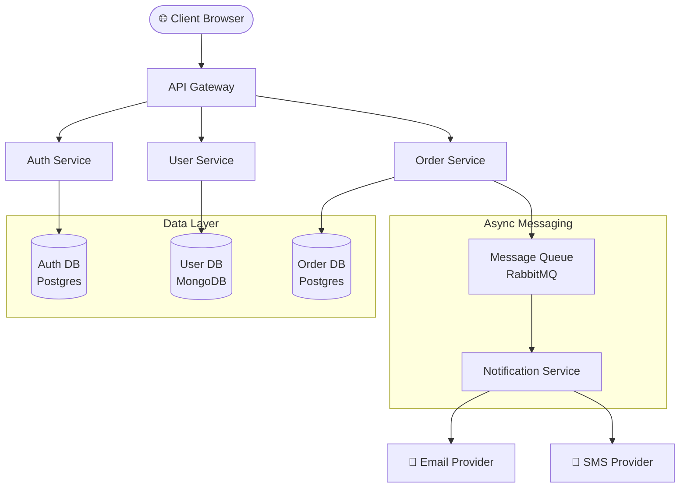
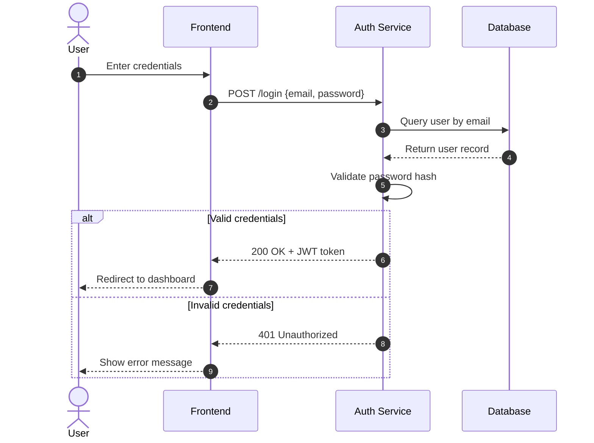
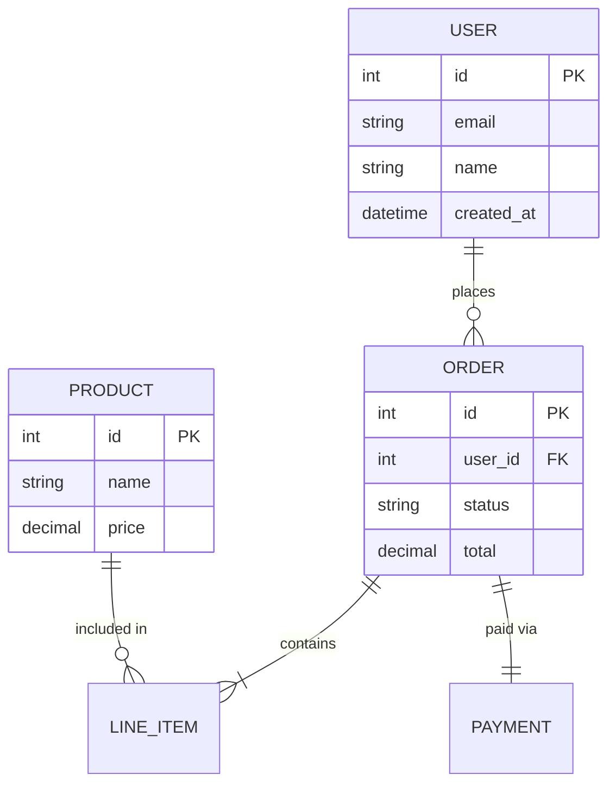
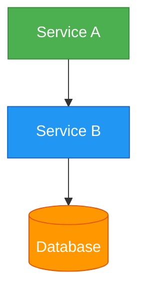
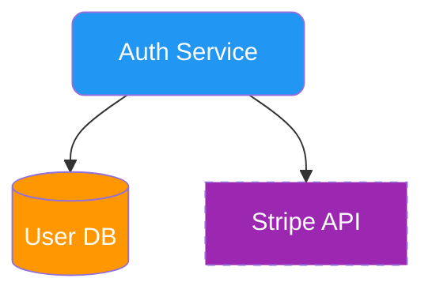
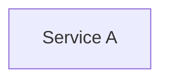

# Architecture Diagram with AI

A practical guide for AI agents to help users create, refine, and export architecture diagrams using Mermaid, Excalidraw, draw.io, and MCP-integrated tools.

---

## 1. TRIGGER CONDITIONS

Load this skill when the user:

- Asks to **draw**, **sketch**, **diagram**, **visualize**, or **map out** a system, flow, or architecture
- Uses keywords: *flowchart*, *sequence diagram*, *class diagram*, *ER diagram*, *system design*, *architecture*, *infrastructure*, *pipeline*, *data flow*, *component diagram*
- Pastes an existing diagram and asks to modify or improve it
- Asks "how does X connect to Y?" in a way that implies a visual answer
- Requests output in Mermaid, Excalidraw, draw.io, PlantUML, or Lucidchart format
- Mentions MCP tools like `mermaid-mcp`, `excalidraw-mcp`, or asks to render a diagram directly

---

## 2. THE SOP — 5-Step Framework

Follow this process for every diagram request:

### Step 1 — Clarify Intent
Understand what the user wants to visualize. Ask (if not clear):
- What is the **subject**? (e.g., microservices, CI/CD pipeline, database schema)
- What **format** do they want? (Mermaid in markdown, exported PNG, editable file)
- What **diagram type** best fits? (flowchart, sequence, ER, class, etc.)
- Any **constraints**? (tool restrictions, rendering environment)

### Step 2 — Select Tool & Diagram Type
Use the decision tree in Section 3 to pick the right tool and diagram type.

### Step 3 — Generate Initial Diagram
Produce a complete, valid diagram in the chosen syntax. Always:
- Use clear, descriptive node labels
- Add comments where the diagram is complex
- Keep it minimal first — add detail on request

### Step 4 — Present & Explain
Render the diagram (or show the code block) and briefly explain:
- What each major component represents
- Key relationships and data flows
- Any simplifications made

### Step 5 — Iterate
Offer to refine: add components, change layout, adjust style, export to another format.

### Process Flowchart



---

## 3. TOOL SELECTION GUIDE

### Decision Tree



### Tool Comparison

**🧜 Mermaid**
- Best for: Markdown/wiki embedding, code-first workflows, CI/CD docs
- Output: SVG/PNG inline, GitHub renders natively
- Editable: Yes (text-based)
- MCP: `mermaid-mcp-server`

**✏️ Excalidraw**
- Best for: Whiteboard-style, collaborative, sketchy/informal look
- Output: `.excalidraw` JSON, PNG, SVG
- Editable: Yes (via excalidraw.com or VS Code plugin)
- MCP: `excalidraw-mcp` (community)

**📐 draw.io / diagrams.net**
- Best for: Formal UML, enterprise architecture, rich shapes/stencils
- Output: `.drawio` XML, PDF, PNG, SVG
- Editable: Yes (GUI editor at app.diagrams.net)
- MCP: None stable yet; generate XML directly

**🌿 PlantUML**
- Best for: UML purists, sequence/class diagrams in CI
- Output: PNG, SVG via server render
- Editable: Text-based
- MCP: Community servers available

---

## 4. DIAGRAM TYPE SELECTION

Which diagram type for which use case:

- **System/service topology** → Architecture/Component → `graph TD`
- **API or service interactions** → Sequence diagram → `sequenceDiagram`
- **Database schema** → Entity-Relationship → `erDiagram`
- **Code/class structure** → Class diagram → `classDiagram`
- **Process or decision flow** → Flowchart → `flowchart TD`
- **Project timeline** → Gantt → `gantt`
- **State machine** → State diagram → `stateDiagram-v2`
- **User journey/experience** → User Journey → `journey`
- **Git branching strategy** → Git graph → `gitGraph`
- **Cloud infrastructure** → `graph LR` with icons or draw.io AWS stencils

### Quick-pick Rules

- **"How does X talk to Y?"** → `sequenceDiagram`
- **"Show me the components"** → `graph TD`
- **"Database tables and relations"** → `erDiagram`
- **"Deployment / infrastructure"** → `graph LR` (Mermaid) or draw.io
- **"Step-by-step process"** → `flowchart TD`
- **"Class hierarchy / OOP"** → `classDiagram`
- **"What states can X be in?"** → `stateDiagram-v2`

---

## 5. MERMAID GENERATION

### Prompting Patterns

Use these templates when generating Mermaid diagrams:

**System Architecture prompt:**
```
Generate a Mermaid `graph TD` diagram for a [system name] with the following components:
- [Component A]: [description]
- [Component B]: [description]
Show data flows between components with labeled arrows.
Group related components in subgraphs.
```

**Sequence Diagram prompt:**
```
Generate a Mermaid sequenceDiagram showing the flow of [action, e.g., user login].
Participants: [User, Frontend, Auth Service, Database]
Steps:
1. [step 1]
2. [step 2]
Include alt/else blocks for error cases.
```

**ER Diagram prompt:**
```
Generate a Mermaid erDiagram for a [domain, e.g., e-commerce] system.
Entities: [User, Order, Product, Payment]
Include all relationships with correct cardinality.
```

### Syntax Rules (Always Follow)

1. **Start with diagram type declaration** — first line must be the type keyword
2. **Node IDs**: alphanumeric, no spaces — use underscores or camelCase
3. **Node labels**: wrap in `["label text"]` for spaces/special chars
4. **Arrow types**:
   - `-->` plain arrow
   - `-- label -->` labeled arrow
   - `==>` thick arrow
   - `-.->` dotted arrow
   - `--x` cross/blocked
5. **Subgraphs** for grouping:
   ```
   subgraph ServiceLayer["Service Layer"]
     A --> B
   end
   ```
6. **Shape types**:
   - `[rect]` rectangle
   - `(rounded)` rounded rect
   - `{diamond}` decision/rhombus
   - `([stadium])` stadium/pill
   - `[[subroutine]]` subroutine
   - `[(cylinder)]` database cylinder

### Complete Example — Microservices Architecture



### Complete Example — User Login Sequence



### Complete Example — ER Diagram



---

## 6. MCP INTEGRATION

### Known MCP Servers for Diagramming

**1. mermaid-mcp-server**
- Repo: https://github.com/peng-shawn/mermaid-mcp-server
- Capabilities: Render Mermaid code to PNG/SVG, validate syntax
- Tools exposed: `render_mermaid`, `validate_mermaid`
- Install: `npm install -g mermaid-mcp-server`

**2. excalidraw-mcp** (community)
- Capabilities: Generate Excalidraw JSON from text descriptions, export to SVG/PNG
- Tools exposed: `create_excalidraw`, `export_excalidraw`

**3. diagrams-mcp** (community)
- Capabilities: Python `diagrams` library for cloud architecture (AWS, GCP, Azure icons)
- Tools exposed: `generate_diagram`

### Configuring in hermes config.yaml

```yaml
# ~/.hermes/config.yaml
mcp:
  servers:
    mermaid:
      command: npx
      args: ["-y", "mermaid-mcp-server"]
      env: {}
    excalidraw:
      command: npx
      args: ["-y", "excalidraw-mcp-server"]
      env: {}
```

Install on-demand via npx (no global install needed):
```bash
# Verify mermaid-mcp-server is available
npx -y mermaid-mcp-server --help
```

### Invoking via MCP Tools

When MCP tools are available, prefer them for rendering:

```python
# Step 1: Validate Mermaid syntax
result = mcp__mermaid__validate_mermaid(
    code="graph TD\n  A[Client] --> B[Server]"
)
# Returns: { valid: true } or { valid: false, error: "Parse error on line 2..." }

# Step 2: Render to PNG
result = mcp__mermaid__render_mermaid(
    code="graph TD\n  A[Client] --> B[Server]",
    format="png",      # or "svg"
    theme="default",   # or "dark", "forest", "neutral"
    background="white"
)
# Returns: { file_path: "/tmp/diagram.png" } or base64 image data
```

**Agent workflow with MCP:**
1. Generate Mermaid code based on user request
2. Call `validate_mermaid` — fix any syntax errors returned
3. Call `render_mermaid` — get rendered image file path or base64
4. Deliver the image to user alongside the source Mermaid code block

**Fallback when MCP is unavailable:**
- Provide raw Mermaid code in a fenced ` ```mermaid ``` ` code block
- Direct user to https://mermaid.live to preview interactively
- Offer to generate draw.io XML or PlantUML as alternative

---

## 7. ITERATIVE REFINEMENT

### Refinement Prompts (offer these proactively)

After delivering an initial diagram, suggest:

> *"Would you like me to:*
> - *Add more detail (protocols, ports, data formats, technologies)?*
> - *Simplify (remove noise, focus on one layer or service)?*
> - *Change layout direction (left-to-right vs top-down)?*
> - *Add styling/colors to distinguish component types?*
> - *Export to a different format (draw.io XML, Excalidraw JSON)?*"

### Styling Techniques

**Add color with `style`:**


**Use `classDef` for consistent theming:**


**Add clickable links (for HTML rendering):**


### Feedback Loop Pattern

When the user says "add X" or "change Y":
1. **Echo** back your understanding of the change
2. Make a **targeted edit** to the existing diagram (avoid full regeneration)
3. **Highlight** what changed with a brief explanation
4. Ask if the change looks right before proceeding further

---

## 8. PITFALLS — Common Mermaid Errors & Fixes

### Parse Error: Special Characters in Labels

❌ Wrong — parentheses break parser:
```
graph TD
    A[My Node (with parens)] --> B
```

✅ Fixed — wrap in quotes:
```
graph TD
    A["My Node (with parens)"] --> B
```

---

### Parse Error: Duplicate Node IDs

❌ Wrong — same ID with different labels:
```
graph TD
    DB[(Database)] --> App
    DB[(Cache)] --> Worker
```

✅ Fixed — use unique IDs:
```
graph TD
    PrimaryDB[(Primary DB)] --> App
    CacheDB[(Cache DB)] --> Worker
```

---

### Parse Error: Subgraph Name Conflicts with Node ID

❌ Wrong:
```
graph TD
    subgraph Backend
        Backend --> DB
    end
```

✅ Fixed — use quoted subgraph label:
```
graph TD
    subgraph BackendLayer["Backend"]
        API --> DB
    end
```

---

### Sequence Diagram: Missing Participant Declaration

❌ Wrong — implicit order causes confusion:
```
sequenceDiagram
    B->>A: Response
    A->>B: Request
```

✅ Fixed — declare participants explicitly:
```
sequenceDiagram
    participant A as Client
    participant B as Server
    A->>B: Request
    B-->>A: Response
```

---

### ER Diagram: Wrong Relationship Syntax

❌ Wrong:
```
erDiagram
    USER -> ORDER
```

✅ Fixed:
```
erDiagram
    USER ||--o{ ORDER : "places"
```

Cardinality notation:
- `||` exactly one
- `o|` zero or one
- `}|` one or more (right side)
- `}o` zero or more (right side)

---

### Emoji/Unicode Breaking Parser

✅ Fix — always wrap emoji labels in quotes:
```
graph TD
    A["🌐 Web Client"] --> B["🔒 Auth Service"]
```

---

### Long Labels Causing Layout Overflow

✅ Fix — use `<br/>` for line breaks within labels:
```
graph TD
    A["Payment<br/>Processing<br/>Service"] --> B
```

---

### Arrow Label Syntax Errors

❌ Wrong:
```
A ->|label| B
```

✅ Fixed:
```
A -->|label| B
```

Or the long form:
```
A -- label --> B
```

---

## 9. VERIFICATION

### How to Verify a Diagram Renders Correctly

**Option 1 — Mermaid Live Editor (fastest, no setup)**
1. Go to https://mermaid.live
2. Paste the Mermaid code in the left panel
3. Preview renders instantly; syntax errors appear in the console panel

**Option 2 — Via MCP Tool (when configured)**
```python
mcp__mermaid__validate_mermaid(code="<your mermaid code here>")
# Returns: { valid: true } or { valid: false, error: "Parse error on line N: ..." }
```

**Option 3 — GitHub / GitLab**
- Paste the code block in a `.md` file — GitHub renders Mermaid natively
- Use the Preview tab before committing

**Option 4 — VS Code**
- Install extension: *Markdown Preview Mermaid Support*
- Open `.md` file → `Ctrl+Shift+V` (or `Cmd+Shift+V` on Mac) to preview

**Option 5 — Mermaid CLI**
```bash
# Install
npm install -g @mermaid-js/mermaid-cli

# Render to PNG
mmdc -i diagram.mmd -o diagram.png

# Render to SVG with dark theme
mmdc -i diagram.mmd -o diagram.svg --theme dark

# Render from stdin
echo "graph TD; A-->B" | mmdc -i /dev/stdin -o out.png
```

### Verification Checklist

Before delivering any diagram, confirm:

- [ ] No parse errors (tested via mermaid.live or MCP validate tool)
- [ ] All nodes have unique, descriptive IDs
- [ ] Labels with special characters (`()`, `[]`, `{}`, `/`, `&`) are quoted
- [ ] Subgraph names don't conflict with node IDs
- [ ] Arrow directions are logically consistent
- [ ] Layout direction is appropriate (TD for hierarchy, LR for pipeline/flow)
- [ ] Related components are grouped in subgraphs
- [ ] Color/styling is applied consistently if used at all
- [ ] No orphaned nodes (every node connects to at least one other)

---

## Quick Reference Card

```
DIAGRAM TYPES (Mermaid):
  flowchart TD/LR     General flow, architecture, pipelines
  sequenceDiagram     API calls, service interactions, auth flows
  erDiagram           Database schemas, data models
  classDiagram        OOP class hierarchy, code structure
  stateDiagram-v2     State machines, lifecycle diagrams
  gantt               Project timelines, sprint planning
  gitGraph            Git branching strategies
  journey             User experience flows

ARROW TYPES (flowchart):
  -->     Plain arrow
  -- x --> Labeled arrow
  ==>     Thick arrow
  -.->    Dotted arrow
  --x     Cross/blocked (no flow)

CARDINALITY (erDiagram):
  ||--||  one-to-one
  ||--o{  one-to-zero-or-many
  ||--|{  one-to-one-or-many

MCP SERVERS:
  mermaid-mcp-server    https://github.com/peng-shawn/mermaid-mcp-server
  excalidraw-mcp        community npm package

ONLINE TOOLS:
  https://mermaid.live       Mermaid live editor + validator
  https://excalidraw.com     Excalidraw whiteboard
  https://app.diagrams.net   draw.io / diagrams.net editor
```
