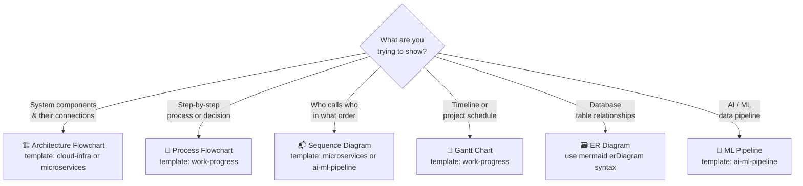

# 📐 Ready-to-Use Diagram Templates

Copy, paste, and fill in the blanks. Each template has clearly marked `[PLACEHOLDER]` slots.

---

## Templates in This Folder

| File | Use Case | Diagram Type |
|---|---|---|
| [ai-ml-pipeline.md](./ai-ml-pipeline.md) | RAG chatbot, ML training, AI agent | Flowchart + Sequence |
| [cloud-infra.md](./cloud-infra.md) | AWS / GCP / Azure, k8s, multi-cloud | Flowchart |
| [microservices.md](./microservices.md) | API gateway, service mesh, event-driven | Flowchart + Sequence |
| [work-progress.md](./work-progress.md) | Sprint board, Gantt, incident response | Gantt + Flowchart |

---

## How to Use a Template

1. Open the template file you need
2. Copy the Mermaid code block
3. Paste into [mermaid.live](https://mermaid.live) (or your editor)
4. Replace every `[PLACEHOLDER]` with your real component name
5. Delete unused sections
6. Done ✅

### With AI (recommended)
Paste a template + this instruction to any LLM:

```
Here is a Mermaid diagram template. Fill in the [PLACEHOLDER] fields
for my system: [describe your system in 2–3 sentences].
Remove any sections that don't apply and add any missing components.
```

---

## Quick Reference: When to Use Which Diagram Type


