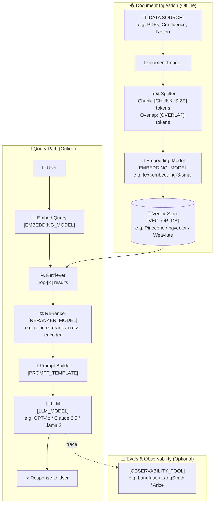
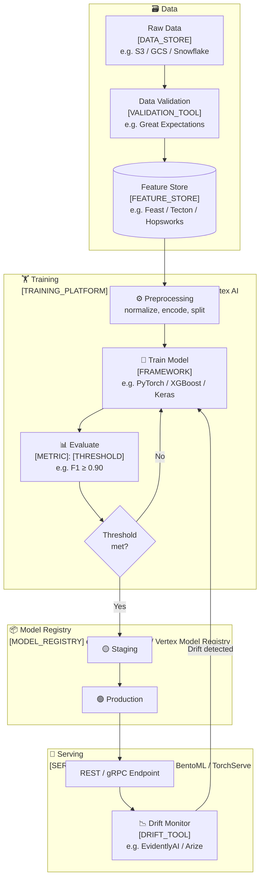
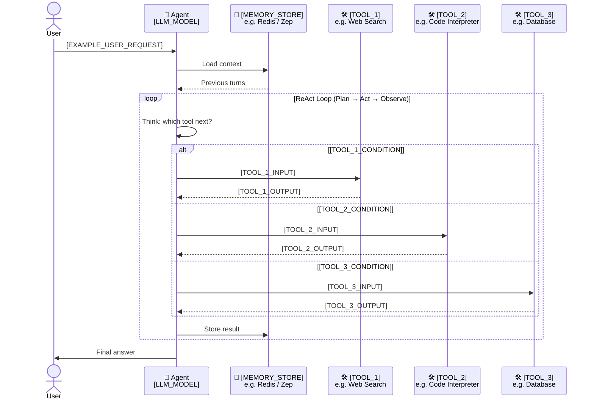

# 🤖 AI / ML Pipeline Template

Three fill-in-the-blank templates for common AI system patterns.

Replace every `[PLACEHOLDER]` with your real component names.

---

## Template 1: RAG Chatbot

**Placeholders to fill:**
- `[DATA SOURCE]` — where your documents live (S3, Notion, file system)
- `[CHUNK_SIZE]` / `[OVERLAP]` — typical starting point: 512 / 50
- `[EMBEDDING_MODEL]` — must match between ingestion and query time
- `[VECTOR_DB]` — Pinecone (managed), pgvector (self-hosted), Weaviate (open source)
- `[K]` — number of chunks to retrieve (typical: 5–20)
- `[RERANKER_MODEL]` — optional but improves precision
- `[LLM_MODEL]` — your generation model
- `[PROMPT_TEMPLATE]` — name of your system prompt / template
- `[OBSERVABILITY_TOOL]` — tracing & eval platform

---

## Template 2: ML Training & Serving Pipeline

**Placeholders to fill:**
- `[DATA_STORE]` — where raw data lives
- `[VALIDATION_TOOL]` — data quality checker
- `[FEATURE_STORE]` — centralised feature computation layer
- `[TRAINING_PLATFORM]` — orchestration for training jobs
- `[FRAMEWORK]` — ML training library
- `[METRIC]` / `[THRESHOLD]` — your promotion gate (e.g. AUC ≥ 0.92)
- `[MODEL_REGISTRY]` — model versioning store
- `[SERVING_PLATFORM]` — inference server
- `[DRIFT_TOOL]` — model monitoring tool

---

## Template 3: AI Agent with Tools

**Placeholders to fill:**
- `[LLM_MODEL]` — e.g. GPT-4o, Claude 3.5 Sonnet
- `[MEMORY_STORE]` — short-term or long-term memory backend
- `[TOOL_1/2/3]` — name each tool the agent can call
- `[TOOL_N_CONDITION]` — when does the agent pick this tool?
- `[TOOL_N_INPUT/OUTPUT]` — example inputs and what the tool returns
- `[EXAMPLE_USER_REQUEST]` — a representative task this agent handles
