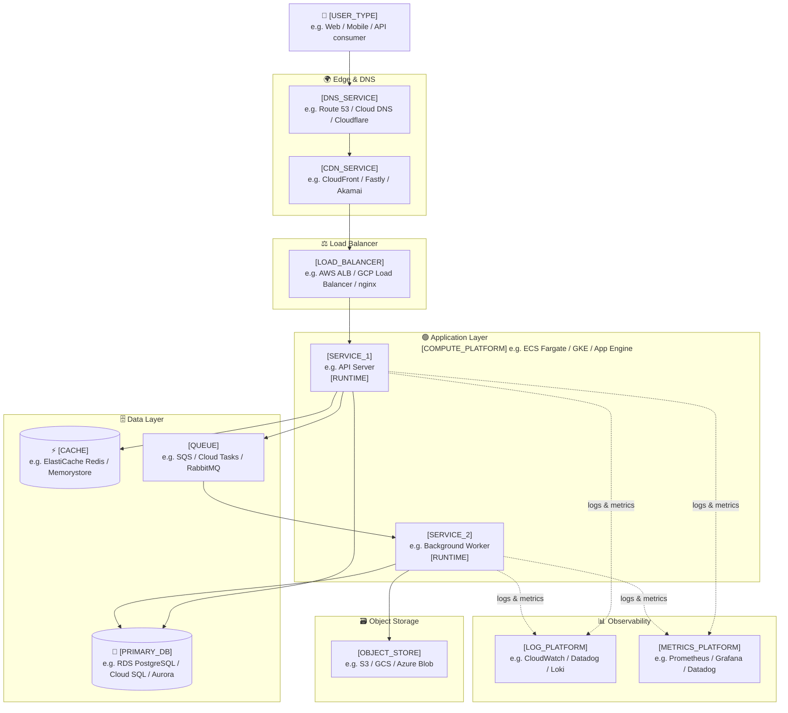
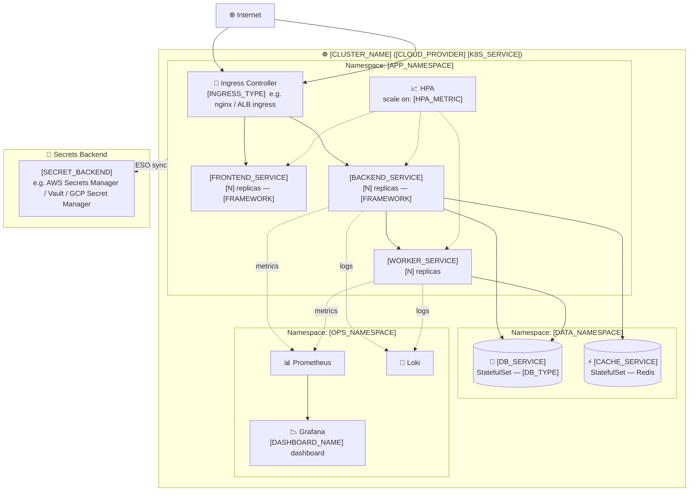

# ☁️ Cloud Infrastructure Template

Two fill-in-the-blank templates for common cloud patterns.

Replace every `[PLACEHOLDER]` with your real component names.

---

## Template 1: Single-Cloud Three-Tier App

**Placeholders to fill:**
- `[USER_TYPE]` — who or what calls this system
- `[DNS_SERVICE]` — your DNS provider
- `[CDN_SERVICE]` — edge caching / DDoS protection
- `[LOAD_BALANCER]` — L7 load balancer
- `[COMPUTE_PLATFORM]` — how containers / VMs are managed
- `[SERVICE_1/2]` — name your app services
- `[RUNTIME]` — language/framework (Node.js, Python, Go…)
- `[PRIMARY_DB]` — main transactional database
- `[CACHE]` — in-memory cache for hot data
- `[QUEUE]` — async job queue
- `[OBJECT_STORE]` — blob / file storage
- `[LOG_PLATFORM]` / `[METRICS_PLATFORM]` — observability stack

---

## Template 2: Kubernetes Cluster

**Placeholders to fill:**
- `[CLUSTER_NAME]` — name of your k8s cluster
- `[CLOUD_PROVIDER]` / `[K8S_SERVICE]` — e.g. AWS EKS, GKE, AKS
- `[APP_NAMESPACE]` / `[DATA_NAMESPACE]` / `[OPS_NAMESPACE]` — your namespace names
- `[INGRESS_TYPE]` — nginx, AWS ALB ingress controller, etc.
- `[FRONTEND/BACKEND/WORKER_SERVICE]` — your service names
- `[N]` — replica count per service
- `[FRAMEWORK]` — tech stack per service
- `[HPA_METRIC]` — CPU / memory / custom metric
- `[DB_SERVICE]` / `[DB_TYPE]` — e.g. postgres / mysql / mongodb
- `[CACHE_SERVICE]` — your Redis service name
- `[DASHBOARD_NAME]` — Grafana dashboard name
- `[SECRET_BACKEND]` — external secrets operator backend
