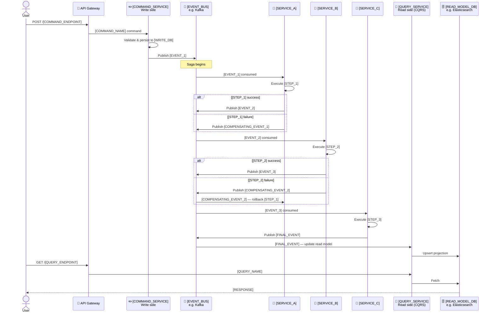

# 🔗 Microservices Architecture Template

Two fill-in-the-blank templates for service mesh and event-driven patterns.

Replace every `[PLACEHOLDER]` with your real component names.

---

## Template 1: API Gateway + Microservices

```mermaid
flowchart LR
    subgraph Clients ["👥 Clients"]
        Web["[CLIENT_1]\ne.g. Web App"]
        Mobile["[CLIENT_2]\ne.g. Mobile App"]
        ThirdParty["[CLIENT_3]\ne.g. Partner API"]
    end

    subgraph Gateway ["🚦 API Gateway\n[GATEWAY_TOOL]  e.g. Kong / AWS API GW / Traefik"]
        GW["API Gateway"]
        Auth["🔐 Auth Middleware\n[AUTH_METHOD]  e.g. JWT / OAuth2 / mTLS"]
        RateLimit["⏱️ Rate Limiter"]
        GW --> Auth --> RateLimit
    end

    subgraph Services ["🔵 Microservices"]
        SvcA["[SERVICE_A]\ne.g. User Service\n[PORT_A]"]
        SvcB["[SERVICE_B]\ne.g. Order Service\n[PORT_B]"]
        SvcC["[SERVICE_C]\ne.g. Inventory Service\n[PORT_C]"]
        SvcD["[SERVICE_D]\ne.g. Notification Service\n[PORT_D]"]
    end

    subgraph Data ["🗄️ Data Stores (per-service)"]
        DBA[("[DB_A]\ne.g. PostgreSQL\nusers DB")]
        DBB[("[DB_B]\ne.g. PostgreSQL\norders DB")]
        DBC[("[DB_C]\ne.g. MongoDB\ninventory DB")]
    end

    subgraph Messaging ["📨 Async Messaging\n[MESSAGE_BUS]  e.g. Kafka / RabbitMQ / SQS"]
        Topic1["[TOPIC_1]\ne.g. order.created"]
        Topic2["[TOPIC_2]\ne.g. inventory.updated"]
    end

    Clients --> GW
    RateLimit -->|/[ROUTE_A]| SvcA
    RateLimit -->|/[ROUTE_B]| SvcB
    RateLimit -->|/[ROUTE_C]| SvcC

    SvcA --> DBA
    SvcB --> DBB
    SvcC --> DBC

    SvcB -->|publish| Topic1
    SvcC -->|subscribe| Topic1
    SvcC -->|publish| Topic2
    SvcD -->|subscribe| Topic2
    SvcD -->|subscribe| Topic1
```

**Placeholders to fill:**
- `[CLIENT_1/2/3]` — your API consumers
- `[GATEWAY_TOOL]` — API gateway software
- `[AUTH_METHOD]` — authentication mechanism
- `[SERVICE_A/B/C/D]` — name each microservice
- `[PORT_A/B/C/D]` — internal ports / gRPC ports
- `[DB_A/B/C]` — each service's own database (polyglot persistence)
- `[MESSAGE_BUS]` — event streaming platform
- `[TOPIC_1/2]` — event topic names (use `verb.noun` convention)
- `[ROUTE_A/B/C]` — API path prefix for each service

---

## Template 2: Event-Driven Architecture (CQRS + Saga)



**Placeholders to fill:**
- `[COMMAND_SERVICE]` — service that handles write operations
- `[EVENT_BUS]` — Kafka, RabbitMQ, AWS EventBridge
- `[SERVICE_A/B/C]` — saga participant services
- `[QUERY_SERVICE]` — read-side query handler
- `[READ_MODEL_DB]` — denormalised read store (Elasticsearch, Redis, DynamoDB)
- `[COMMAND_ENDPOINT]` — e.g. `/orders`
- `[COMMAND_NAME]` — e.g. `PlaceOrder`
- `[WRITE_DB]` — command-side database
- `[EVENT_1/2/3]` — domain events (e.g. `OrderPlaced`, `PaymentCharged`)
- `[STEP_1/2/3]` — what each service does in the saga
- `[COMPENSATING_EVENT_1/2]` — rollback events on failure
- `[FINAL_EVENT]` — saga completion event
- `[QUERY_ENDPOINT]` — e.g. `/orders/:id`
- `[QUERY_NAME]` — e.g. `GetOrderById`
- `[RESPONSE]` — shape of the query response
